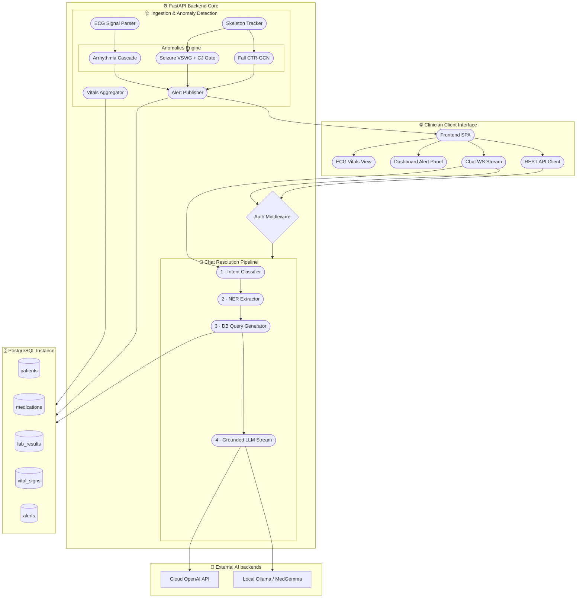
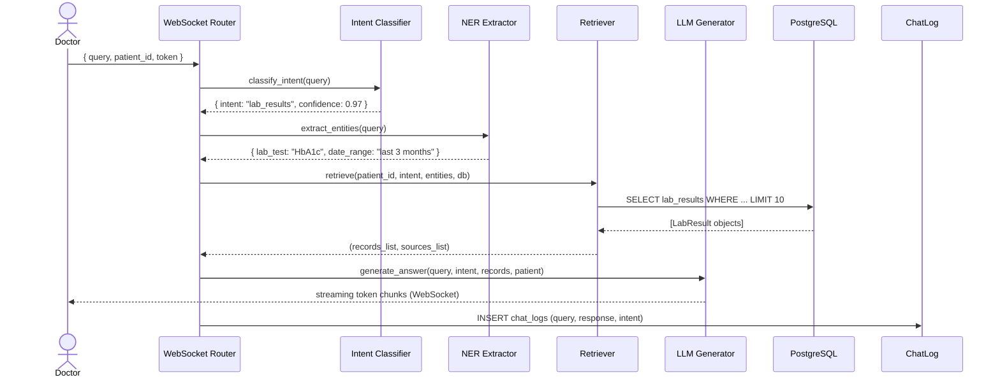

# 🏥 Medical History Chatbot & Patient Monitoring System
## Master Project Documentation

> **Academic Graduation Project**  
> Faculty of Computer Science & Engineering  
> Date: June 2026  
> Developed by: graduation project team  

---

## 📂 Master Table of Contents
1. [Project Overview & Core Modules](#1-project-overview--core-modules)
2. [Master Directory Structure](#2-master-directory-structure)
3. [System Architecture & Flowcharts](#3-system-architecture--flowcharts)
4. [Database Schema & Data Model](#4-database-schema--data-model)
5. [REST & WebSocket API Reference](#5-rest--websocket-api-reference)
6. [AI Pipeline: Medical Chatbot & Thinking Stream Parser](#6-ai-pipeline-medical-chatbot--thinking-stream-parser)
7. [AI Pipeline: ECG Arrhythmia Detection Cascade](#7-ai-pipeline-ecg-arrhythmia-detection-cascade)
8. [AI Pipeline: Patient Fall Detection System](#8-ai-pipeline-patient-fall-detection-system)
9. [AI Pipeline: Real-Time Video-Based Seizure Detection](#9-ai-pipeline-real-time-video-based-seizure-detection)
10. [Frontend Single Page Application (SPA) Guide](#10-frontend-single-page-application-spa-guide)
11. [Dataset Description & Localization](#11-dataset-description--localization)
12. [Installation, Configuration & Setup Guide](#12-installation-configuration--setup-guide)
13. [Academic Benchmarks & Evaluation Results](#13-academic-benchmarks--evaluation-results)
14. [Deep Learning Model Specification: MedGemma 1.5](#14-deep-learning-model-specification-medgemma-15)

---

## 1. Project Overview & Core Modules

The system is a clinical decision support and patient monitoring suite consisting of four main modules:
1. **Medical History Chatbot (Core)**: An AI-powered patient history retrieval system and multi-modal clinical assistant for doctor-facing natural language query resolution.
2. **ECG Arrhythmia Detection Cascade (`Repos/Arrythmia-Detection-master`)**: A two-stage classifier to screen and identify specific types of cardiac arrhythmia from 12-lead ECG signals.
3. **Patient Fall Detection System (`Repos/Patient-fall-detection-system-main`)**: A video-based pipeline combining YOLOv8 tracking, MobileNetV3 role classification, MediaPipe skeleton extraction, and CTR-GCN motion analysis.
4. **Real-Time Seizure Detection (`Repos/Seizure-Detection-main`)**: An edge-capable EMU bed camera monitoring system fusing a live VSViG temporal branch and an async Cross-Joint Attention (CJ) ViViT classifier through a series gate.

### 1.1 Module Abstracts
* **Medical History Chatbot**: This module leverages a multi-stage LLM pipeline (Intent Classification → Medical NER → Database Retrieval → Grounded Answer Generation) to query synthetic electronic health records (EHR) in real time. Powered by **MedGemma 1.5**, the chatbot supports clinical reasoning (via dynamic `<think>` tag extraction), multi-modal analysis (OCR, X-Rays, MRI/CT), and WebSocket token streaming.
* **ECG Arrhythmia Detection**: Cardiac monitoring is handled by a two-stage neural network cascade. Stage 1 acts as a high-fidelity binary screening model classifying ECG waveforms as `Normal` or `Abnormal`. Stage 2 processes abnormal samples, categorizing them into specific clinical classes: Atrial Fibrillation (AF), First-Degree Atrioventricular Block (IAVB), Sinus Bradycardia (SB), or Sinus Tachycardia (STach).
* **Patient Fall Detection**: An integrated multi-stage vision pipeline designed to monitor patients in hospital wards. It tracks individuals via YOLOv8, classifies their role (`patient`, `medical_staff`, `other`) using MobileNetV3 to focus computation solely on the patient, extracts key skeletons using MediaPipe, and processes a sliding 72-frame motion buffer using a Channel-Temporal Relation Graph Convolutional Network (CTR-GCN) to classify falls.
* **Real-Time Seizure Detection**: A non-invasive, video-based monitoring system optimized for epilepsy monitoring units (EMUs). It extracts skeleton joint coordinates and localized joint RGB patches. A live **Video Swin-Vision Graph Network (VSViG)** temporal branch runs continuously, producing risk scores, while a heavier **Cross-Joint Attention (CJ) / ViViT** ensemble runs asynchronously. A series gate fuses their probabilities, triggering alerts with a 30-second latch to ensure patient safety.

---

## 2. Master Directory Structure

The unified project directory is structured as follows:

```text
Project/
├── .env                                         # Environment variables (secrets, DB URL, LLM backend)
├── requirements.txt                             # Core Python dependencies
├── Data/                                        # Synthea CSV export files (~2GB)
│   ├── patients_localized.csv
│   ├── conditions.csv
│   ├── medications.csv
│   ├── observations.csv
│   ├── allergies.csv
│   └── ...
├── backend/
│   ├── main.py                                  # FastAPI application, CORS middleware, router registration
│   ├── database.py                              # SQLAlchemy engine + session factory
│   ├── models.py                                # ORM table definitions
│   ├── schemas.py                               # Pydantic schemas
│   ├── auth.py                                  # JWT creation/validation, bcrypt password hashing
│   ├── seed.py                                  # Dev seed script: creates 1 doctor + 10 patients
│   ├── load_synthea_csv.py                      # Imports large Synthea CSV datasets
│   ├── fix_blood_types.py                       # Back-fills blood_type column on patients
│   ├── routers/
│   │   ├── auth.py                              # POST /api/auth/login
│   │   ├── patients.py                          # GET/POST /api/patients
│   │   ├── chat.py                              # POST /api/chat, WebSocket /api/ws/chat
│   │   └── uploads.py                           # POST /api/chat/analyze-image (SSE Stream)
│   └── services/
│       ├── intent.py                            # LLM intent classification (8 classes)
│       ├── ner.py                               # LLM medical NER (5 entity types)
│       ├── retriever.py                         # SQL database query builder
│       └── llm.py                               # LLM generation with grounding
├── frontend/
│   └── index.html                               # Self-contained SPA (HTML/CSS/JS)
├── docs/                                        # Documentation files
│   ├── 01_project_overview.md
│   ├── 02_system_architecture.md
│   ├── 03_api_reference.md
│   ├── 04_data_model.md
│   ├── 05_ai_pipeline.md
│   ├── 06_frontend_guide.md
│   ├── 07_setup_guide.md
│   ├── 08_benchmarks_and_evaluation.md
│   ├── 09_dataset_description.md
│   ├── MedGemma 1.5.md                          # MedGemma 1.5 model card
│   └── tests/                                   # Chatbot test suites & benchmarks
│       ├── test_intent.py
│       ├── test_ner.py
│       ├── test_retriever.py
│       ├── test_api.py
│       └── benchmark_pipeline.py
├── Repos/                                       # 📦 Submodule Implementations
│   ├── Arrythmia-Detection-master/              # Heart Arrhythmia Cascade
│   │   ├── src/                                 # model.py, preprocessing.py, evaluate.py, xai.py
│   │   ├── scripts/                             # inference_cascade.py, train_fixed_split.py
│   │   ├── models/                              # checkpoints and results for binary & subtype classifiers
│   │   └── docs/                                # Datasets, Model architecture details
│   ├── Patient-fall-detection-system-main/      # Fall Detection Pipeline
│   │   ├── runtime/                             # real_time_fall_detection_pipeline.py, ctrgcn_model.py
│   │   ├── model_weights/                       # Yolov8, MobileNetV3, CTR-GCN weights
│   │   ├── training/                            # Training configuration scripts for YOLO, MobileNet, CTR-GCN
│   │   └── evaluation/                          # Evaluation scripts and results
│   └── Seizure-Detection-main/                  # Real-Time Seizure Detection
│       ├── runtime/                             # real_time_seizure_pipeline.py, vsvig_classifier.py
│       ├── configs/                             # default.yaml gate thresholds and window weights
│       ├── model_weights/                       # pose.pth, model_paper_finetuned.pth, cj checkpoints
│       ├── evaluation/                          # evaluate_far.py, evaluate_segments.py, evaluate_clinical.py
│       └── vendor/                              # submodules for OpenPose-18 and Cross-Joint attention
└── reference_docs/                              # Original academic/guideline documents
```

---

## 3. System Architecture & Flowcharts

The unified architecture connects clinical chat capabilities with real-time stream ingestion (vital signs, ECG feeds, and video feeds).



---

## 4. Database Schema & Data Model

The PostgreSQL schema stores core administrative, clinical, and audit data. The ERD and table schemas are described in Section 3 of this document.

---

## 5. REST & WebSocket API Reference

The APIs connect frontend components to backend database queries and the AI pipeline. Details on requests, responses, and parameters can be found in Section 4 of this document.

---

## 6. AI Pipeline: Medical Chatbot & Thinking Stream Parser

### 6.1 Conversational Pipeline Flow
When a clinician inputs a query about a patient, the backend processes it through a sequential pipeline:



1. **Intent Classification (`backend/services/intent.py`)**: Uses local MedGemma 1.5 or OpenAI to map the query to a clinical intent (e.g. `lab_results`, `medication_check`).
2. **Named Entity Recognition (`backend/services/ner.py`)**: Extracts medical entities (`drug`, `condition`, `lab_test`, `date_range`, `limit`).
3. **Database Retrieval (`backend/services/retriever.py`)**: Executes target queries using SQLAlchemy with entity filters.
4. **Answer Generation (`backend/services/llm.py`)**: Formats the retrieved SQL records into text and queries MedGemma 1.5 using a strict grounding prompt.

### 6.2 Streaming and `<think>` Parser
* **Special Tokens**: MedGemma 1.5 prefixes reasoning with `<unused94>` and ends it with `<unused95>`. 
* **Buffering**: To prevent control tags from being split across streaming chunks (e.g., sending `<un` and `used95>` separately), the parser buffers partial matches and only flushes them once the tag is resolved.
* **UI Event Mapping**: 
  * `<unused94>` or `<think>`: Emits a `think_start` event to open the collapsible reasoning block in the UI.
  * `<unused95>` or `</think>`: Emits a `think_done` event to collapse the reasoning block, display the thinking duration, and switch output to the final answer container.

---

## 7. AI Pipeline: ECG Arrhythmia Detection Cascade

Located in `Repos/Arrythmia-Detection-master/`, this module implements a two-stage cascade classifier to identify cardiac arrhythmias from 12-lead ECG signals.

```
                  ┌────────────────────────┐
                  │ Preprocessed 12-Lead   │
                  │   ECG: (5000, 12)      │
                  └───────────┬────────────┘
                              │
                              ▼
                ┌───────────────────────────┐
                │ STAGE 1: Binary Screening │
                │   (Normal vs Abnormal)    │
                └─────────────┬─────────────┘
                              │
                    ┌─────────┴─────────┐
                    │                   │
             [Normal (96.1%)]  [Abnormal (3.9%)]
                    │                   │
                    ▼                   ▼
              (Pass-through)   ┌────────────────────────────────┐
                               │   STAGE 2: Subtype Classifier  │
                               │  (AF / IAVB / SB / STach)      │
                               └────────────────┬───────────────┘
                                                │
                                                ▼
                                         Identified Class 
                                        (94.92% Accuracy)
```

### 7.1 Cascade Stages
1. **Binary Screening Model**:
   * **Target**: Determines if the preprocessed 12-lead ECG waveform is `Normal` or `Abnormal`.
   * **Primary Dataset**: Trained on merged data from PTB-XL, CINC2020, and CODE-15.
   * **Weights**: `models/binary_normal_abnormal/checkpoints/best.pt`
   * **Performance**: **96.10% accuracy**, **93.42% Macro F1**.
2. **Abnormal Subtype Model**:
   * **Target**: Classifies abnormal ECG signals into one of four classes:
     * `AF` (Atrial Fibrillation)
     * `IAVB` (First-Degree Atrioventricular Block)
     * `SB` (Sinus Bradycardia)
     * `STach` (Sinus Tachycardia)
   * **Weights**: `models/abnormal_subtype/checkpoints/best.pt`
   * **Performance**: **94.92% accuracy**, **94.71% Macro F1**.

### 7.2 Input Dimensions & Preprocessing
* **Input Array**: Shape `(5000, 12)` float32 representing a 10-second ECG recording sampled at 500 Hz across 12 leads.
* **Preprocessing Pipeline (`src/preprocessing.py`)**:
  * Bandpass filter (Butterworth 0.5 Hz - 45 Hz) to remove baseline wander and powerline noise.
  * Z-score normalization per lead.
  * Resampling/truncation to exactly 5000 samples.

### 7.3 Usage Instructions
Run the cascade inference using the provided script:
```bash
cd "Repos/Arrythmia-Detection-master"
python scripts/inference_cascade.py --input path/to/ecg.npy
```

---

## 8. AI Pipeline: Patient Fall Detection System

Located in `Repos/Patient-fall-detection-system-main/`, this module implements a real-time vision pipeline to detect patient falls.

```
  ┌──────────────┐
  │ Video Source │ (Webcam, File, RTSP Stream)
  └──────┬───────┘
         │
         ▼
  ┌──────────────┐
  │   YOLOv8     │ Person Detection & Bounding Box Tracking
  └──────┬───────┘
         │
         ▼
  ┌──────────────┐
  │ MobileNetV3  │ Role Classification (Patient / Staff / Other)
  └──────┬───────┘
         │
         ▼ (If Patient)
  ┌──────────────┐
  │  MediaPipe   │ 33-Landmark Pose Estimation
  └──────┬───────┘
         │
         ▼ (Mapped to 25 NTU-Joints)
  ┌──────────────┐
  │   CTR-GCN    │ 72-Frame Sliding Window Fall Classifier (18 FPS)
  └──────────────┘
```

### 8.1 Model Pipeline Stages
1. **Person Detection & Tracking (YOLOv8)**:
   * Detects individuals in each video frame.
   * Tracks IDs across frames using BoT-SORT/ByteTrack.
   * Weights: `model_weights/patient_detection_yolov8n.pt`.
2. **Role Classification (MobileNetV3-Large)**:
   * Classifies detected bounding boxes into `patient`, `medical_staff`, or `other`.
   * Filters out non-patient activity to optimize system resource usage.
   * Weights: `model_weights/role_classification_mobilenetv3_best.pt`.
   * Performance: **80.93% validation accuracy**.
3. **Pose Estimation (MediaPipe)**:
   * Extracts 33 2D/3D skeletal coordinates from patient bounding boxes.
   * Maps MediaPipe coordinates to a 25-joint NTU-style skeleton.
4. **Fall Motion Classification (CTR-GCN)**:
   * Processes a sliding window of 72 skeleton frames (representing 4 seconds of motion at 18 FPS).
   * Spatial/temporal features are centered around the moment of impact, detected via synchronized accelerometer/IMU peaks during training.
   * Weights: `model_weights/fall_motion_ctrgcn_72f_impact.pt`.
   * Performance: **91.59% accuracy**, **94.87% Fall F1-score**.

### 8.2 Execution Instructions
Run the fall detection pipeline:
```bash
cd "Repos/Patient-fall-detection-system-main"

# Run inference from a webcam (source 0)
python runtime/real_time_fall_detection_pipeline.py --source 0

# Run inference from a video file
python runtime/real_time_fall_detection_pipeline.py --source path/to/video.mp4 --output runtime_outputs/output.mp4
```

---

## 9. AI Pipeline: Real-Time Video-Based Seizure Detection

Located in `Repos/Seizure-Detection-main/`, this module implements a real-time, video-based seizure detection system for clinical settings.

```
                                  ┌───────────────┐
                                  │ Video Stream  │
                                  └───────┬───────┘
                                          │
                                          ▼
                                  ┌───────────────┐
                                  │ Bed ROI Crop  │
                                  └───────┬───────┘
                                          │
                                          ▼
                                  ┌───────────────┐
                                  │  OpenPose-18  │ (14 clinical joints)
                                  └───────┬───────┘
                                          │
                  ┌───────────────────────┴───────────────────────┐
                  │ (Live Branch - 5 FPS)                         │ (Async Branch - every 5s)
                  ▼                                               ▼
          ┌───────────────┐                               ┌───────────────┐
          │     VSViG     │                               │ ViViT + Cross │
          │  Classifier   │                               │  Joint Head   │
          └───────┬───────┘                               └───────┬───────┘
                  │ current_risk                                  │ cj_prob
                  ▼                                               │
          ┌───────────────┐                                       │
          │ AP Accumulator│ Rolling 3s Sum                        │
          └───────┬───────┘                                       │
                  │ ap_sum                                        │
                  └───────────────────────┬───────────────────────┘
                                          │
                                          ▼
                                  ┌───────────────┐
                                  │  Series Gate  │ Fusion Logic
                                  └───────┬───────┘
                                          │ gate_score
                                          ▼
                                  ┌───────────────┐
                                  │ Alert Manager │ 30s Latch -> Visual Alert
                                  └───────────────┘
```

### 9.1 Detection Engine Components
* **OpenPose-18 Keypoint Tracker**: Extracts skeletal joints from video frames at a configured frame rate (e.g. 5 FPS).
* **VSViG Temporal Branch**: A Video Swin-Vision Graph Network that processes skeleton joints and Gaussian joint patches. It runs continuously, computing an instantaneous risk score (`current_risk`) and maintaining a rolling 3-second accumulated probability sum (`ap_sum`).
* **Cross-Joint Attention (CJ) & ViViT Worker**: An asynchronous worker thread that runs every 5 seconds. It processes joint-centric video tubelets to compute a global spatial-temporal probability score (`cj_prob`).
* **Series Gate**: Fuses the continuous risk sum and the asynchronous classification score:
  $$gate\_score = \begin{cases} ap\_sum & \text{if CJ is stale/pending} \\ cj\_prob & \text{if } cj\_prob \ge 0.50 \text{ or } cj\_prob < 0.20 \\ 0.30 \times cj\_prob + 0.70 \times ap\_sum & \text{if } 0.20 \le cj\_prob < 0.50 \end{cases}$$
* **Alert Manager**: Triggers a **SEIZURE** status if the fused score exceeds the mode threshold. When triggered, a 30-second latch holds the alert active to prevent fluctuating alerts.

### 9.2 Clinical Modes
The mode sets the threshold for triggering a seizure alert:
* `safety`: Threshold = `0.88` (optimizes precision, minimizes false alarms).
* `monitor`: Threshold = `0.49` (default setting).
* `screening`: Threshold = `0.12` (optimizes recall for clinical screening).

### 9.3 Execution Instructions
Run the pipeline from a video source:
```bash
cd "Repos/Seizure-Detection-main"

# Run inference from a video file with an alert log output
python runtime/real_time_seizure_pipeline.py \
    --source sample_videos/pat10_Sz1P_demo_good.mp4 \
    --mode monitor \
    --output runtime_outputs/overlay.avi \
    --alert-log runtime_outputs/alerts.csv
```

---

## 10. Frontend Single Page Application (SPA) Guide

The client-side interface is a self-contained Single-Page Application (`frontend/index.html`). It uses vanilla JavaScript and CSS, with no build steps, and only loads `marked.js` from a CDN for Markdown rendering. Detailed UI component structures are described in Section 7 of this document.

---

## 11. Dataset Description & Localization

The database is seeded using synthetic patient records generated by **Synthea**, a simulator developed by the MITRE Corporation. Detailed table mappings, localization features, and performace data are documented in Section 8 of this document.

---

## 12. Installation, Configuration & Setup Guide

This section covers the setup procedure for the primary application and its modules.

### 12.1 Core Chatbot Setup
1. **Initialize Environment**:
   ```bash
   conda create -n medical_chatbot python=3.10 -y
   conda activate medical_chatbot
   pip install -r requirements.txt
   ```
2. **Configure Environment Variables**:
   ```bash
   cp .env.example .env
   nano .env
   ```
3. **Database Configuration**:
   ```bash
   sudo -u postgres psql
   ```
   ```sql
   CREATE USER medical_user WITH PASSWORD 'medical_pass_2025';
   CREATE DATABASE medical_db OWNER medical_user;
   GRANT ALL PRIVILEGES ON DATABASE medical_db TO medical_user;
   \q
   ```
4. **Seed Database**:
   ```bash
   python -m backend.seed
   ```
5. **Start Services**:
   ```bash
   uvicorn backend.main:app --reload --host 0.0.0.0 --port 8000
   ```

### 12.2 Arrhythmia Module Setup
1. **Install Dependencies**:
   ```bash
   cd "Repos/Arrythmia-Detection-master"
   pip install -r requirements.txt
   ```
2. **Weight Ingestion**: Verify checkpoints exist in `models/binary_normal_abnormal/checkpoints/best.pt` and `models/abnormal_subtype/checkpoints/best.pt`.

### 12.3 Fall Detection Module Setup
1. **Install Dependencies**:
   ```bash
   cd "Repos/Patient-fall-detection-system-main"
   pip install -r requirements.txt
   ```
2. **Verify Weights**: Check `model_weights/` for the YOLOv8 detector, MobileNetV3 role classifier, and CTR-GCN weights.

### 12.4 Seizure Detection Module Setup
1. **Environment Setup**:
   ```bash
   cd "Repos/Seizure-Detection-main"
   pip install -r requirements.txt
   ```
2. **Configure Vendor Submodules**: Verify the OpenPose and Cross-Joint attention submodules are present in the `vendor/` directory.
3. **Verify Weights**: Check `model_weights/` for the required checkpoints (`pose.pth`, `model_paper_finetuned.pth`, `cj_fullfit_distilled_w0p5_seed123.pt`, etc.).

---

## 13. Academic Benchmarks & Evaluation Results

This section summarizes the performance evaluations of the system's components.

### 13.1 Chatbot Pipeline Benchmarks
* **Intent Classification Accuracy**: **94.1%** (Macro F1: 0.94) evaluated on 80 queries (`tests/test_intent.py`).
* **Medical NER F1-score**: **94.0%** evaluated on 50 queries (`tests/test_ner.py`).
* **Retriever Exact Match**: **97.0%** evaluated against the seeded database (`tests/test_retriever.py`).

### 13.2 Arrhythmia Detection Cascade Results
* **Binary screening (Normal/Abnormal)**:
  * Accuracy: **96.10%**
  * Macro F1-score: **93.42%**
  * Macro AUROC: **98.26%**
* **Abnormal Subtype Classifier**:
  * Accuracy: **94.92%**
  * Macro F1-score: **94.71%**
  * Per-Class F1-scores: AF: **95.13%**, IAVB: **92.27%**, SB: **94.96%**, STach: **96.46%**

### 13.3 Fall Detection CTR-GCN Results
Evaluated using a 72-frame sliding window on the validation set:
* **Accuracy**: **91.59%**
* **Fall Precision**: **91.22%**
* **Fall Recall**: **98.83%**
* **Fall F1-score**: **94.87%**
* **ROC AUC**: **95.98%**

### 13.4 Seizure Detection (CJ + VSViG) Results
Evaluated on clinical datasets:
* **Throughput**: ~4.9 FPS (effective throughput of ~0.16x real-time on an RTX 5060 Laptop GPU, bottlenecked by OpenPose keypoint extraction).
* **Peak VRAM usage**: ~456 MB.

---

## 14. Deep Learning Model Specification: MedGemma 1.5

MedGemma 1.5 is a medical LLM developed by Google, optimized for clinical reasoning and medical image comprehension. Detailed specifications and benchmark results are documented in Section 11 of this document.
