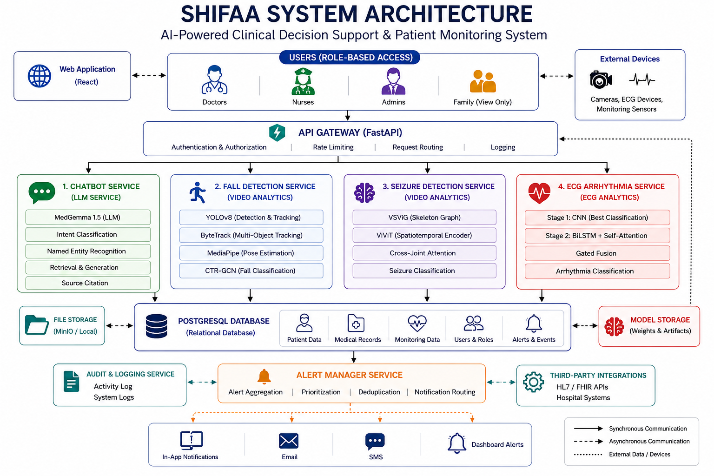
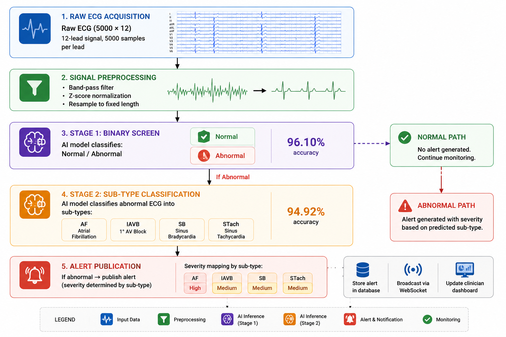
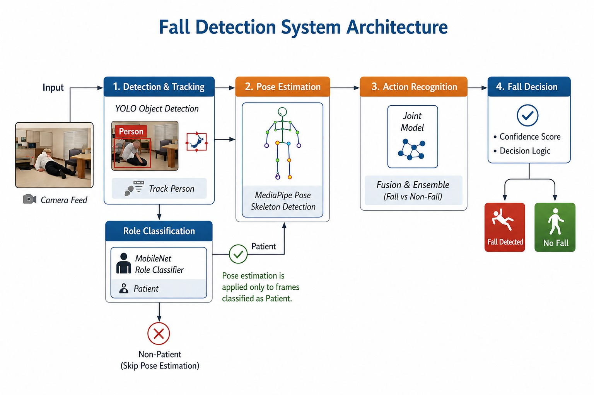
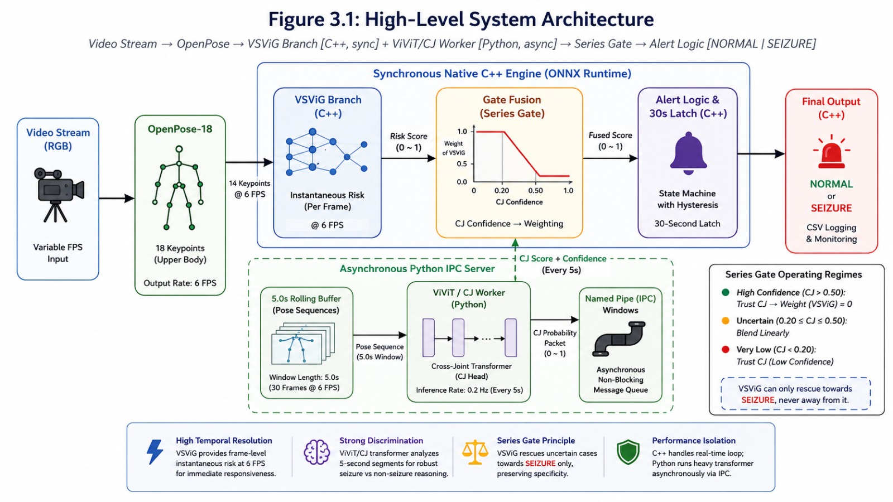
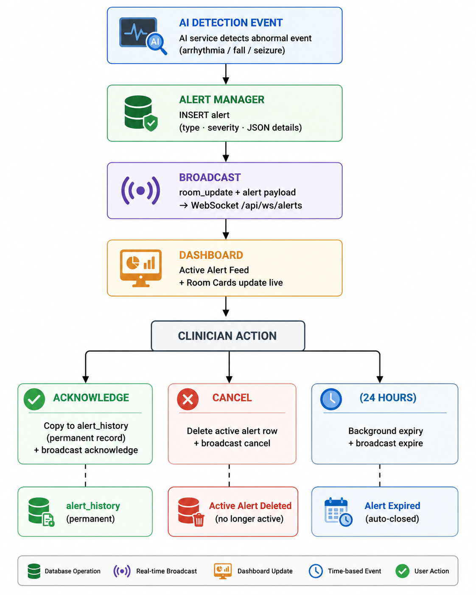
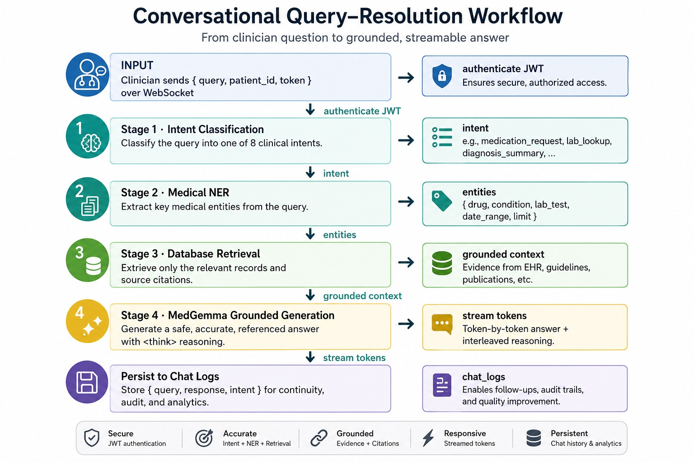

# 🏥 Shifaa — AI-Powered Clinical Decision Support & Patient Monitoring

> **Shifaa** is a production-grade, privacy-first hospital monitoring platform that unifies a grounded medical AI assistant with three real-time detection systems (cardiac arrhythmia, patient falls, and epileptic seizures) behind a single role-aware interface — all running fully on-premises.

Developed as a graduation project at **Ain Shams University, Faculty of Computer & Information Sciences (2026)** by the AI Department team, under supervision of Dr. Salsabil Amin and T.A. Manar Sultan.

---

## ✨ Key Features

| Module                      | Capability                                                                         |
| --------------------------- | ---------------------------------------------------------------------------------- |
| 🤖 **Medical Chatbot**      | Natural-language patient record Q&A, grounded in the EHR, ≤ 1 % hallucination      |
| 🫀 **Arrhythmia Detection** | Two-stage ECG cascade — 96.1 % / 94.9 % accuracy on Stage 1 / Stage 2              |
| 🚶 **Fall Detection**       | Four-stage vision pipeline (YOLO → Role → Pose → CTR-GCN), 98.83 % recall          |
| 🧠 **Seizure Detection**    | Hybrid C++/ONNX + Python ViViT series-gate, ~37 FPS real-time, 96.69 % AUROC       |
| 🔔 **Alert Lifecycle**      | Persist → Broadcast → Acknowledge → Archive — no alert ever lost                   |
| 🏠 **Room-Centered RBAC**   | Doctor / Nurse / Admin roles; nurses scoped to assigned rooms                      |
| 📊 **Live Dashboards**      | Ward station, per-room monitoring, service health, alert feeds                     |
| 🔒 **Privacy by Default**   | Entire stack — including LLM — runs locally; zero patient data leaves the premises |

---

## 🗺️ System Architecture



---

## 📂 Repository Structure

```
.
├── backend/                  # FastAPI application
│   ├── routers/              #   API routes: auth, patients, rooms, chat, monitoring, dashboard, uploads, users, arrhythmia
│   ├── services/             #   Business logic: AlertManager, LLM client, inference clients
│   └── tests/                #   Unit & database tests
│
├── frontend/                 # Vite + React 18 + Tailwind CSS + Zustand SPA
│
├── services/                 # Independent AI microservices (each has its own README)
│   ├── arrhythmia/           #   ECG binary screen + sub-type classifier
│   ├── fall_detection/       #   YOLO + MobileNetV3 + MediaPipe + CTR-GCN pipeline
│   └── seizure_detection/    #   C++/ONNX native runtime + Python ViViT worker (IPC)
│
├── models/                   # Pre-trained model weights (place here before first run)
│   ├── arrhythmia/
│   ├── fall/
│   └── seizure/
│
├── datasets/                 # Synthea CSV exports for bulk patient seeding
├── configs/                  # .env templates and configuration files
├── deployment/               # Docker, systemd, and orchestration assets
├── scripts/                  # start_all_services.ps1 / .sh launchers
├── tools/                    # Database seed, room migration, Synthea loader scripts
├── tests/                    # Unified integration and end-to-end tests
├── runtime/                  # Generated logs and transient temp files (git-ignored)
├── uploads/                  # Clinical uploads and test media
├── requirements.txt          # Python backend dependencies
└── README.md                 # You are here
```

> **Never modify** `runtime/` or anything auto-generated by `start_all_services`. Place new model weights under `models/<service>/`.

---

## 🚀 Getting Started

### Prerequisites

| Requirement         | Version            | Notes                                     |
| ------------------- | ------------------ | ----------------------------------------- |
| Python              | 3.10+              | Backend + inference services              |
| Node.js             | 18+                | Frontend build                            |
| NVIDIA GPU + CUDA   | 11.8 / 12.x        | Required for real-time vision inference   |
| Ollama              | latest             | Optional — local MedGemma backend         |
| ONNX Runtime + MSVC | ORT 1.23+, VS 2022 | **Windows only** — seizure native runtime |
| CMake               | 3.16+              | Seizure runtime build                     |

---

### 1 · Clone

```bash
git clone https://github.com/omarelnokrashy/Shifaa-AI-Based-Patient-Monitoring-System.git
cd Shifaa-AI-Based-Patient-Monitoring-System
```

---

### ⚡ Quick Setup (Recommended)

Run the one-shot setup script. It installs CUDA PyTorch, all Python deps, copies `.env`,
seeds the database, and caches the ViViT model automatically:

**Windows:**
```powershell
# Activate your conda env first:
conda create -n shifaa python=3.10 -y && conda activate shifaa
powershell -ExecutionPolicy Bypass -File .\scripts\setup.ps1
```

**Linux / macOS:**
```bash
conda create -n shifaa python=3.10 -y && conda activate shifaa
bash scripts/setup.sh
```

> Skip to **[Step 6 · Start All Services](#6--start-all-services)** after the script completes.

---

*Or follow the manual steps below:*

### 2 · Python Environment

```bash
conda create -n shifaa python=3.10 -y
conda activate shifaa
```

**GPU users (required for fall & seizure detection):** Install CUDA-enabled PyTorch
*before* running `requirements.txt` — the default pip build is CPU-only:
```bash
# CUDA 11.8:
pip install torch torchvision --index-url https://download.pytorch.org/whl/cu118
# or CUDA 12.x:
pip install torch torchvision --index-url https://download.pytorch.org/whl/cu121
# Then install onnxruntime-gpu for GPU-accelerated ONNX inference:
pip install onnxruntime-gpu>=1.23.0
```

Then install all other dependencies:
```bash
pip install -r requirements.txt
```

### 3 · Configure Environment Variables

```bash
cp .env.example .env
# Review .env and set SECRET_KEY to a long random string
```

Key variables (full reference in [Appendix A](#configuration-reference)):

| Variable       | Default                     | Description                                    |
| -------------- | --------------------------- | ---------------------------------------------- |
| `SECRET_KEY`   | _(required)_                | Long random string for JWT signing             |
| `LLM_BACKEND`  | `ollama`                    | `ollama` (local) or `openai` (cloud)           |
| `OLLAMA_MODEL` | `medgemma1.5:latest`        | Model served by Ollama                         |
| `DATABASE_URL` | `sqlite:///./medical_db.db` | Unset for SQLite; point at PostgreSQL for prod |

### 4 · Seed the Database

```bash
python tools/seed.py                # Create accounts + 10 synthetic patients
python tools/migrate_db_rooms.py    # Create ward rooms
# (Optional) load ~1 000 Synthea patients
python tools/load_synthea_csv.py
```

Default test credentials:

| Role   | Email               | Password  |
| ------ | ------------------- | --------- |
| Doctor | doctor@hospital.com | doctor123 |
| Nurse  | nurse@hospital.com  | nurse123  |
| Admin  | admin@hospital.com  | admin123  |

### 5 · (Optional) Download ViViT Weights + Start Local LLM

Download the ViViT model weights used by the seizure detection service:
```bash
python scripts/download_vivit.py   # ~300 MB, required for seizure service
```

If using Ollama for local LLM inference:
```bash
ollama pull medgemma1.5:latest
ollama pull qwen2.5:0.5b
ollama serve
```

### 6 · Start All Services

**Windows:**

```powershell
./scripts/start_all_services.ps1
```

**Linux / macOS:**

```bash
./scripts/start_all_services.sh
```

This starts four processes:

| Service                   | Port |
| ------------------------- | ---- |
| FastAPI Gateway           | 8000 |
| Arrhythmia Service        | 8001 |
| Fall Detection Service    | 8002 |
| Seizure Detection Service | 8003 |

> ⚠️ The native seizure runtime must be compiled once with CMake + Visual Studio before the seizure service can start. See `services/seizure_detection/README.md`.

### 7 · Frontend

```bash
cd frontend
cp .env.example .env
# Set VITE_DATA_MODE=live and VITE_API_URL=http://localhost:8000
npm install
npm run dev
```

Open **http://localhost:5173**. Set `VITE_DATA_MODE=mock` for an offline demo with simulated data.

### 8 · Health Check

- API docs: http://localhost:8000/docs
- Dashboard: http://localhost:5173 → Admin → System

---

## 🤖 AI Services

### 🫀 Arrhythmia Detection

A two-stage deep-learning cascade classifies a 10-second, 12-lead ECG (5000 × 12 array).



Each stage uses a **dual-branch CNN–BiLSTM–Attention** network (~1.12 M parameters) fused with 7 hand-crafted QRS/heart-rate statistics. Trained on PTB-XL + CINC2020 + CODE-15 with strict patient-level split isolation.

**API:** `POST /api/arrhythmia/analyze` → returns stage results + probabilities + alert ID.

---

### 🚶 Fall Detection

A four-stage computer-vision pipeline processes a camera stream in real time.



Results: **91.59% accuracy · 98.83% recall · 94.87% fall F1** at threshold 0.50.

**API:** WebSocket `WS /api/ws/camera/{room_id}` — forward JPEG frames, receive per-frame events.

---

### 🧠 Seizure Detection

A hybrid native/managed runtime sustains real-time throughput on modest hardware.



Two clinical modes: **monitor** (threshold 0.49) and **safety** (threshold 0.88).

Results: **96.69% AUROC · 90.18% F1 · 98.45% recall · ~37.2 FPS steady-state**.

> **Windows-only**: the C++ runtime uses Win32 named-pipe IPC. Linux port is on the roadmap (see §Future Work).

**API:** `POST /api/monitoring/seizure/start` → server-sent event stream.

---

## 🔔 Alert Lifecycle



Every alert carries a **full raw inference payload** (JSON `details` column) for audit. The active and history tables are kept separate so the audit trail is never overwritten.

---

## 🗣️ Conversational AI Pipeline

Four sequential stages resolve a clinician's natural-language question:



Supported intents: `history_lookup`, `medication_check`, `lab_results`, `allergy_check`, `visit_summary`, `diagnosis_check`, `risk_flag`, `general_question`.

---

## 🔐 Backend Architecture

| Layer         | Technology              | Role                                                  |
| ------------- | ----------------------- | ----------------------------------------------------- |
| Web framework | FastAPI + Uvicorn       | REST + WebSocket + SSE gateway                        |
| Auth          | JWT (HS256) + bcrypt    | Stateless auth; RBAC per endpoint                     |
| ORM           | SQLAlchemy              | Sync/async queries over SQLite or PostgreSQL          |
| Alert hub     | `AlertManager` service  | Publish, broadcast, expire — single source of truth   |
| AI clients    | Async HTTP + WS clients | Thin wrappers for the three inference services        |
| LLM client    | OpenAI-compatible SDK   | Targets Ollama (local) or cloud, switchable by config |

**Nine routers:** `auth`, `patients`, `rooms`, `chat`, `uploads`, `users`, `arrhythmia`, `monitoring`, `dashboard`.

---

## 🖥️ Frontend Architecture

Built with **React 18 · Vite · Tailwind CSS · Zustand · React Router · Axios · Recharts**.

| Concern        | Approach                                                                                        |
| -------------- | ----------------------------------------------------------------------------------------------- |
| State          | Two Zustand stores: `authStore` (JWT + decoded user) · `alertsStore` (live feed, capped at 200) |
| Routing        | Declarative `RoleGuard` — redirects unauthenticated users and role mismatches                   |
| Real-time      | `useAlerts` hook — WebSocket with exponential back-off reconnection                             |
| Streaming chat | `useChatStream` hook — separates `<think>` reasoning blocks from final answer                   |
| Data mode      | `VITE_DATA_MODE=mock` → simulated data; `live` → real backend                                   |

**Pages by role:**

| Role   | Pages                                                                                                           |
| ------ | --------------------------------------------------------------------------------------------------------------- |
| Doctor | Dashboard · Rooms Board · Patient List · Patient Detail (Overview / Chat / ECG / Logs) · Live Monitor · Sandbox |
| Nurse  | Triage Dashboard · Scoped Ward Monitor                                                                          |
| Admin  | System Health · User Management · Room Configuration                                                            |

---

## 📈 Benchmark Summary

| Subsystem           | Metric                      | Result                   |
| ------------------- | --------------------------- | ------------------------ |
| Chatbot — Intent    | Accuracy / Macro-F1         | 94.1% / 0.94             |
| Chatbot — NER       | Macro-F1                    | 94.0%                    |
| Chatbot — Retrieval | Exact match                 | 97.0%                    |
| Chatbot — Grounding | Hallucination rate          | ≤ 1%                     |
| ECG Stage 1         | Accuracy / AUROC            | 96.10% / 98.26%          |
| ECG Stage 2         | Accuracy / AUROC            | 94.92% / 99.43%          |
| Fall — CTR-GCN      | Accuracy / Fall-F1 / Recall | 91.59% / 94.87% / 98.83% |
| Seizure — segments  | AUROC / F1 / Recall         | 96.69% / 90.18% / 98.45% |
| Seizure — runtime   | Throughput                  | ~37.2 FPS                |

---

## ⚙️ Configuration Reference

### Backend (`.env`)

| Variable                        | Required  | Default                     | Description                                 |
| ------------------------------- | --------- | --------------------------- | ------------------------------------------- |
| `SECRET_KEY`                    | ✅        | —                           | JWT signing key                             |
| `DATABASE_URL`                  | ❌        | `sqlite:///./medical_db.db` | PostgreSQL connection string for production |
| `LLM_BACKEND`                   | ❌        | `ollama`                    | `ollama` or `openai`                        |
| `OLLAMA_MODEL`                  | ❌        | `medgemma1.5:latest`        | Ollama model name                           |
| `OPENAI_API_KEY`                | if openai | —                           | Cloud LLM API key                           |
| `ARRHYTHMIA_SERVICE_URL`        | ❌        | `http://localhost:8001`     |                                             |
| `FALL_DETECTION_SERVICE_URL`    | ❌        | `http://localhost:8002`     |                                             |
| `SEIZURE_DETECTION_SERVICE_URL` | ❌        | `http://localhost:8003`     |                                             |

### Frontend (`frontend/.env`)

| Variable         | Description                                             |
| ---------------- | ------------------------------------------------------- |
| `VITE_API_URL`   | Backend REST base URL (e.g. `http://localhost:8000`)    |
| `VITE_WS_URL`    | Backend WebSocket base URL (e.g. `ws://localhost:8000`) |
| `VITE_DATA_MODE` | `mock` for offline demo · `live` for real backend       |

---

## 🛠️ Technology Stack

| Category         | Technology                                                           |
| ---------------- | -------------------------------------------------------------------- |
| Languages        | Python 3.10, JavaScript ES2022, C++17, SQL                           |
| Backend          | FastAPI, Uvicorn, SQLAlchemy, Pydantic, python-jose, passlib/bcrypt  |
| Database         | SQLite (default) · PostgreSQL 14+ (production)                       |
| LLM              | MedGemma 1.5 via Ollama (local) or OpenAI-compatible cloud           |
| Deep Learning    | PyTorch, Ultralytics YOLOv8, MediaPipe, timm, transformers           |
| Native Inference | ONNX Runtime (CUDA/TensorRT), C++17, Win32 named-pipe IPC, OpenCV    |
| Frontend         | React 18, Vite, Tailwind CSS, Zustand, React Router, Axios, Recharts |
| Testing          | pytest, httpx                                                        |
| Data             | Synthea, pandas, wfdb, Faker                                         |
| Tooling          | Git, Conda, Node.js/npm, CMake, Visual Studio 2022, VS Code          |

---

## 🩺 Troubleshooting

| Symptom                              | Likely Cause                       | Fix                                                   |
| ------------------------------------ | ---------------------------------- | ----------------------------------------------------- |
| DB errors on first run               | Wrong `DATABASE_URL`               | Unset it for SQLite, or start PostgreSQL              |
| 500 on login                         | bcrypt version mismatch            | `pip install bcrypt==4.0.1`                           |
| WebSocket refused                    | Backend not running                | Verify Uvicorn + `VITE_WS_URL`                        |
| LLM timeout                          | Model not loaded                   | `ollama pull medgemma1.5:latest`                      |
| Blank patient list                   | Empty database                     | Run `python tools/seed.py`                            |
| Seizure stuck on SEIZURE             | 30-second latch active             | Wait for latch to clear, or call reset-latch endpoint |
| `No providers found` / pipe errno 22 | C++ runtime not built with CUDA EP | Rebuild in Release with CUDA provider DLLs            |
| Service offline in dashboard         | Inference service not started      | Run launcher script or start service on 8001–8003     |

---

## 🚀 Production Deployment

```bash
# Backend — Gunicorn + Uvicorn workers
gunicorn backend.main:app -w 4 -k uvicorn.workers.UvicornWorker \
  --bind 0.0.0.0:8000

# Frontend — build static assets
cd frontend && npm run build
```

Serve the built frontend and proxy `/api/` and WebSocket traffic with **Nginx** (template in `deployment/`). Set `DATABASE_URL` to a PostgreSQL connection string and replace `SECRET_KEY` with a long random value. Restrict CORS to the real frontend origin.

For containerized deployment see `deployment/docker-compose.yml`.

---

## 📚 Documentation

| Resource                 | Location                                                                                                     |
| ------------------------ | ------------------------------------------------------------------------------------------------------------ |
| Thesis Document          | `docs/research/Shifaa_Documentation.pdf`                                                                     |
| Shifaa's Paper           | `docs/research/paper.pdf`                                                                                    |
| Software Documentation   | `docs/software_doc.md`                                                                                       |
| Interactive API docs     | http://localhost:8000/docs (auto-generated by FastAPI)                                                       |
| Service-specific READMEs | `services/arrhythmia/README.md`, `services/fall_detection/README.md`, `services/seizure_detection/README.md` |
| RAG READMEs              | `docs/RAG`                                                                                                   |

---

## 👥 Team

**Ain Shams University · Faculty of Computer & Information Sciences · AI Department · Class of 2026**

| Name                 | Student ID | LinkedIn                                                                                                                                                |
| -------------------- | ---------- | ------------------------------------------------------------------------------------------------------------------------------------------------------- |
| Omar Elsayed Ibrahim | 2022170827 | <a href="https://www.linkedin.com/in/omarelnokrashy/"></a>      |
| Omar Mohamed Adel    | 2022170829 | <a href="https://www.linkedin.com/in/omar-mohamed-salama/"></a> |
| Ali Tarek Fekry      | 2022170825 | <a href="https://www.linkedin.com/in/alymaklad/"></a>           |
| Hazem Mohamed        | 2022170810 | <a href="https://www.linkedin.com/in/hazem-abdelazim/"></a>     |
| Abdelrhman Mahmoud   | 2022170846 | <a href="https://www.linkedin.com/in/abdulrehman-mahmoud05"></a>  |

**Supervisors:** Dr. Salsabil Amin · T.A. Manar Sultan

---

## 📄 License

This project is a graduation project submission. Contact the authors or faculty for usage and licensing information.

---

<p align="center">
  <em>Built with ❤️ for safer hospitals.</em>
</p>
