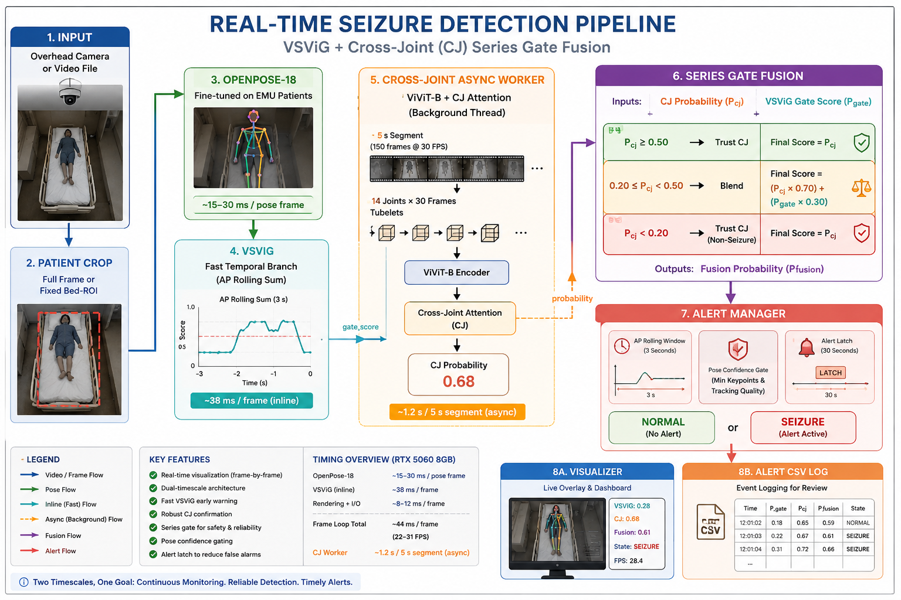

# Real-Time Seizure Detection

Video-based seizure detection from an EMU bed camera. The system fuses a lightweight VSViG temporal branch with an async Cross-Joint / ViViT classifier through a series gate, producing two clinical alert states — **NORMAL** and **SEIZURE** — with a 30-second alert latch.



---

## How It Works

Each video frame passes through four sequential stages:

1. **Patient crop** — isolate the bed region (full frame or a fixed ROI).
2. **OpenPose-18** — extract 14 clinically relevant keypoints at the configured cadence.
3. **VSViG branch** — produce an instantaneous seizure risk `current_risk` and accumulate it into a rolling 3-second AP sum (`ap_sum`).
4. **Cross-Joint worker** — run an async ViViT + CJ ensemble every ~5 seconds; fuse its result with `ap_sum` through the series gate to produce the final `seizure_signal`.

The series gate logic:

```
if CJ is missing or stale:      gate_score = ap_sum
elif cj_prob >= 0.50:           gate_score = cj_prob
elif cj_prob >= 0.20:           gate_score = 0.30 × cj_prob + 0.70 × ap_sum
else:                           gate_score = cj_prob
```

`gate_score` is compared against the active mode threshold. Once **SEIZURE** fires, the alert latch holds the state active for 30 seconds regardless of subsequent scores.

---

## Repository Layout

```
seizure_detection/
├── README.md
├── requirements.txt
├── system_diagram.png
├── configs/
│   └── default.yaml              Runtime defaults (gate params, AP window, thresholds)
├── runtime/
│   ├── real_time_seizure_pipeline.py   ← main entry point
│   ├── inference.py                    Shared inference engine
│   ├── patient_tracking.py             Bed ROI / crop management
│   ├── pose_extraction.py              OpenPose-18 wrapper
│   ├── vsvig_classifier.py             VSViG forward pass
│   ├── cross_joint_worker.py           Async CJ / ViViT worker thread
│   ├── series_gate.py                  Gate fusion logic
│   ├── event_aggregator.py             Episode start / end / duration tracking
│   ├── alert_manager.py                AP accumulation + 30-second alert latch
│   ├── stream_visualizer.py            Live frame overlay
│   ├── models/
│   │   └── vsvig.py
│   └── utils/
│       ├── config.py
│       ├── logger.py
│       ├── cj_head.py                  JointTransformerClassifier definition
│       ├── paths.py
│       ├── patches.py
│       ├── patch_ops.py                Gaussian joint patch extraction
│       └── tubelet_builder.py          Joint-centric ViViT tubelet assembly
├── model_weights/                      All required runtime checkpoints
├── sample_videos/                      Demo clips with confirmed positive LEO / negative LCO
├── evaluation/
│   └── scripts/
│       ├── evaluate_far.py             False alert rate from alert CSV logs
│       ├── evaluate_segments.py        AUROC / AUPRC / F1 from score CSVs
│       ├── evaluate_clinical.py        LEO / LCO from event timing
│       └── evaluate_runtime.py         FPS / VRAM profiling
├── vendor/
│   ├── lightweight-human-pose-estimation.pytorch/
│   └── joint-attention-seizure-detection/
└── runtime_outputs/                    Generated at runtime (gitignored)
```

---

## Setup

### Prerequisites

- Python 3.10+
- NVIDIA GPU with CUDA 12.x recommended (CPU fallback is available but very slow)

### Install

```powershell
cd F:\GP\seizure_detection
python -m venv .venv
.\.venv\Scripts\Activate.ps1
pip install -r requirements.txt
```

Vendor submodules must be present:

```
vendor/lightweight-human-pose-estimation.pytorch
vendor/joint-attention-seizure-detection
```

### Model Weights

Place the following files in `model_weights/`:

| File | Purpose |
|---|---|
| `pose.pth` | Lightweight OpenPose-18 |
| `model_paper_finetuned.pth` | VSViG temporal branch |
| `dy_point_order.pt` | VSViG dynamic partition order |
| `cj_fullfit_distilled_w0p5_seed123.pt` | CJ head — seed 123 (deployment) |
| `cj_fullfit_distilled_w0p5_seed789.pt` | CJ head — seed 789 (deployment) |

Quick weight check:

```powershell
python -c "
from pathlib import Path
p = Path('model_weights')
files = [
    'pose.pth', 'model_paper_finetuned.pth', 'dy_point_order.pt',
    'cj_fullfit_distilled_w0p5_seed123.pt',
    'cj_fullfit_distilled_w0p5_seed789.pt',
]
[print('OK' if (p/f).exists() else 'MISSING', f) for f in files]
"
```

---

## Running Inference

### From a video file

```powershell
python runtime\real_time_seizure_pipeline.py `
    --source sample_videos\pat10_Sz1P_demo_good.mp4 `
    --mode monitor `
    --output runtime_outputs\pat10_demo_overlay.avi `
    --alert-log runtime_outputs\pat10_demo_alerts.csv `
    --no-display
```

### From a live camera

```powershell
python runtime\real_time_seizure_pipeline.py --source 0 --mode monitor
```

### Headless batch (fastest)

```powershell
python runtime\real_time_seizure_pipeline.py `
    --source sample_videos\pat10_Sz1P_demo_good.mp4 `
    --mode monitor `
    --no-display --no-output --fast-skip-decode `
    --alert-log runtime_outputs\pat10_headless_alerts.csv
```

### Multiple videos in one process

```powershell
python runtime\real_time_seizure_pipeline.py `
    --source-list sample_videos\demo_sources.txt `
    --mode monitor `
    --no-display --no-output --fast-skip-decode `
    --alert-log-dir runtime_outputs\batch_alert_logs
```

---

## Clinical Modes

The mode controls the `gate_score` threshold for a SEIZURE alert:

| Mode | Threshold | Use case |
|---|---:|---|
| `safety` | 0.88 | Highest precision; lowest false-alert risk |
| `monitor` | 0.49 | Default — balanced continuous monitoring |
| `screening` | 0.12 | Maximum sensitivity; intended for research or ICU |

Pass with `--mode safety`, `--mode monitor`, or `--mode screening`.

---

## All Runtime Flags

| Flag | Default | Description |
|---|---|---|
| `--source` | — | Camera index, video file path, or RTSP URL |
| `--source-list` | — | Text file with one source per line (batch mode) |
| `--mode` | `monitor` | Clinical alert mode: `safety`, `monitor`, or `screening` |
| `--output` | — | Path to save annotated AVI output |
| `--alert-log` | — | Per-frame alert CSV path (single source) |
| `--alert-log-dir` | — | Output directory for per-source CSV logs (batch mode) |
| `--config` | `configs/default.yaml` | Runtime config file |
| `--bed-roi` | full frame | Patient bed crop: `x1,y1,x2,y2` in pixels |
| `--no-display` | off | Disable the OpenCV preview window |
| `--no-output` | off | Disable annotated video writing |
| `--max-frames` | `0` | Stop after N frames; `0` = full source |
| `--patient-fps` | `5.0` | OpenPose / VSViG cadence in FPS |
| `--alert-hold` | `30.0` | Alert latch duration in seconds |
| `--use-amp` | off | Enable AMP for the VSViG branch |
| `--disable-cj-amp` | off | Disable AMP for the async CJ / ViViT worker |
| `--fast-skip-decode` | off | Use `cap.grab()` on non-inference frames (headless only) |
| `--sync-alert-log` | off | Write CSV rows synchronously instead of in background |
| `--disable-cj-async` | off | Disable the CJ worker; use VSViG / AP path only |
| `--disable-live-vsvig` | off | Disable the live VSViG branch when CJ is active |
| `--profile` | off | Print per-component timing every 50 frames |
| `--profile-out` | — | Optional JSON file for the profile summary |

---

## Alert CSV Output

One row is written per video frame to the `--alert-log` file.

| Column | Description |
|---|---|
| `frame` | Frame index from pipeline start |
| `time_sec` | Video timestamp in seconds |
| `status` | `INITIALISING`, `NORMAL`, or `SEIZURE` |
| `seizure_signal` | Final gate score compared against the mode threshold |
| `seizure_source` | What drove the score (see table below) |
| `ap_sum` | Rolling 3-second AP evidence sum |
| `current_risk` | Latest VSViG instantaneous probability |
| `cj_prob` | Latest CJ probability (blank until the first segment completes) |
| `cj_age_sec` | Wall-clock age of the latest CJ result |
| `pose_conf_mean` | Mean OpenPose joint confidence |
| `alert_latched` | `1` when the 30-second latch is holding SEIZURE active |
| `x1,y1,x2,y2` | Patient crop bounding box in frame pixels |

### Status values

| Status | Meaning |
|---|---|
| `INITIALISING` | AP buffer and CJ worker are both still warming up |
| `NORMAL` | Signal is below threshold; no latch is active |
| `SEIZURE` | Signal crossed the threshold, or the alert latch is holding |

### Seizure source values

| Source | Meaning |
|---|---|
| `INITIALISING` | No usable AP or CJ evidence yet |
| `CJ_PENDING` | CJ result not available; AP is used if ready |
| `VSViG_AP` | CJ is stale or disabled; AP is the decision signal |
| `CJ` | `cj_prob >= 0.50` — CJ trusted directly |
| `BLEND` | `0.20 <= cj_prob < 0.50` — CJ and AP blended |
| `CJ_LOW` | `cj_prob < 0.20` — CJ non-seizure zone trusted |
| `LATCH/<source>` | 30-second latch is holding a prior alert active |

---

## Key Configuration Values

Stored in `configs/default.yaml`. The most important parameters:

```yaml
# Gate
gate_lower_bound: 0.20      # Below this cj_prob: trust CJ non-seizure directly
gate_alpha: 0.30            # CJ weight in the blend zone (0.30×CJ + 0.70×AP)

# AP accumulator
ap_window_sec: 3.0          # Rolling window length for AP sum

# Alert latch
alert_hold_sec: 30.0        # Minimum SEIZURE hold duration after firing

# CJ staleness limits
cj_max_age_normal: 15.0     # Discard CJ result older than this during NORMAL
cj_max_age_alert: 60.0      # Extended staleness tolerance during active SEIZURE

# CJ inference
cj_use_amp: true            # AMP enabled for CJ / ViViT worker by default

# Patient branch
patient_branch_fps: 5.0     # OpenPose + VSViG call rate
```

Mode thresholds are set in `runtime/real_time_seizure_pipeline.py` and are not in the YAML:

```python
safety    = 0.88
monitor   = 0.49
screening = 0.12
```

---

## Sample Videos

`sample_videos/` contains clips that passed the demo filter — positive LEO, negative LCO, and zero pre-EEG alert events:

| File | Notes |
|---|---|
| `pat03_Sz1PG_demo_good.mp4` | Generalized tonic-clonic |
| `pat03_Sz2PG_demo_good.mp4` | Generalized tonic-clonic |
| `pat04_Sz1P_demo_good.mp4` | Focal seizure |
| `pat05_Sz3PG_demo_good.mp4` | Generalized tonic-clonic |
| `pat10_Sz1P_demo_good.mp4` | Focal seizure |
| `pat10_Sz2P_demo_good.mp4` | Focal seizure |
| `pat12_Sz2P_demo_good.mp4` | Focal seizure |
| `pat12_Sz4P_demo_good.mp4` | Focal seizure |
| `demo_sources.txt` | Source list for `--source-list` batch runs |

---

## Evaluation

```powershell
# False alert rate from a generated alert log
python evaluation\scripts\evaluate_far.py `
    runtime_outputs\pat10_demo_alerts.csv --mode monitor `
    --out-json runtime_outputs\far_summary.json

# Segment-level classification metrics (AUROC / AUPRC / F1)
python evaluation\scripts\evaluate_segments.py `
    --scores-csv evaluation\results\official_test_scores.csv `
    --threshold 0.3081087228480716 `
    --out-json evaluation\results\segment_metrics.json

# Clinical LEO / LCO from event timing
python evaluation\scripts\evaluate_clinical.py

# FPS and VRAM profiling
python evaluation\scripts\evaluate_runtime.py
```

---

## Runtime Performance

Measured on this machine (RTX 5060 Laptop GPU, 8 GB VRAM):

| Metric | Value |
|---|---|
| Effective throughput | ~0.16× real-time (~4.9 FPS equivalent) |
| Peak VRAM | ~456 MB reserved |
| Main bottleneck | OpenPose latency |

The pipeline is causal and stream-capable. It will run at real-time or faster on hardware with stronger GPU throughput.

Flags used for the profiled run: `--no-display --no-output --fast-skip-decode` with CJ AMP on and async CSV logging.

---

## Model Weights Reference

| File | Purpose | Notes |
|---|---|---|
| `pose.pth` | OpenPose-18 | Fine-tuned on EMU patients |
| `model_paper_finetuned.pth` | VSViG temporal branch | Locally fine-tuned |
| `dy_point_order.pt` | VSViG dynamic partition order | Required for correct ViG inference |
| `cj_fullfit_distilled_w0p5_seed123.pt` | CJ head seed 123 | **Active deployment weight** |
| `cj_fullfit_distilled_w0p5_seed789.pt` | CJ head seed 789 | **Active deployment weight** |
| `cj_distilled_w0p5_seed123.pt` | CJ head seed 123 | Held-out benchmark weight (retained for comparison) |
| `cj_distilled_w0p5_seed789.pt` | CJ head seed 789 | Held-out benchmark weight (retained for comparison) |

---

## Troubleshooting

| Symptom | Likely cause | Fix |
|---|---|---|
| `ModuleNotFoundError: models.with_mobilenet` | OpenPose vendor folder missing | Check `vendor/lightweight-human-pose-estimation.pytorch` |
| `ModuleNotFoundError: seizure_classifier` | CJ vendor folder missing | Check `vendor/joint-attention-seizure-detection` |
| `cj_prob` blank at startup | CJ worker is still collecting its first clip | Normal; wait ~5 seconds |
| `status` starts as `INITIALISING` | AP buffer warming up | Normal startup behavior; clears automatically |
| `status` stuck on `SEIZURE` after movement stops | Alert latch is active | Check `alert_latched=1` in the CSV; it clears after `alert_hold_sec` |
| `current_risk` always 0.0 | VSViG AMP issue on this GPU | Do not use `--use-amp`; AMP is off by default for VSViG |
| CUDA out of memory | Competing GPU processes | Close other GPU apps or use `--disable-cj-async` |
| Very slow inference | CPU fallback active | Confirm `Inference on cuda` is printed at startup |
| High false alert rate in monitor mode | Known limitation at 0.49 threshold | Use `--mode safety` for clinical deployment |

---

## Notes

- Raw patient datasets are intentionally excluded from this package.
- All generated outputs (videos, CSVs, profiles) should go to `runtime_outputs/`.
- The system detects visible motor manifestations only. Non-motor and subtle seizure types have not been evaluated.
- Training code is not included in this deployable package.

---

## Known Limitations

- **Non-motor seizures:** The system detects motor manifestations. Subtle or
  absent-movement seizure types have not been evaluated.
- **Single-institution dataset:** All results are based on 14 subjects from one
  EMU. Cross-site generalization has not been validated.
- **ViViT streaming latency:** The current incremental (rolling 1s) ViViT path
  takes ~1.16 s per step.
  
---

## References

1. Xu, Y. et al. (2024). VSViG: Real-Time Video-Based Seizure Detection via
   Skeleton-Based Spatiotemporal ViG. *ECCV 2024*.
2. Zamzam, O. et al. (2026). Learning Cross-Joint Attention for Generalizable
   Video-Based Seizure Detection. *arXiv:2603.23757*.
3. Daniil Osokin. Lightweight Human Pose Estimation (PyTorch).
   https://github.com/Daniil-Osokin/lightweight-human-pose-estimation.pytorch

---

## Citation

```bibtex
@misc{seizuredetection2026,
  title  = {Real-Time Seizure Detection via CJ + VSViG Series Gate},
  author = {Omar Salama},
  year   = {2026},
  note   = {Graduation project, Faculty of Computer Science - Ain Shams University}
}
```