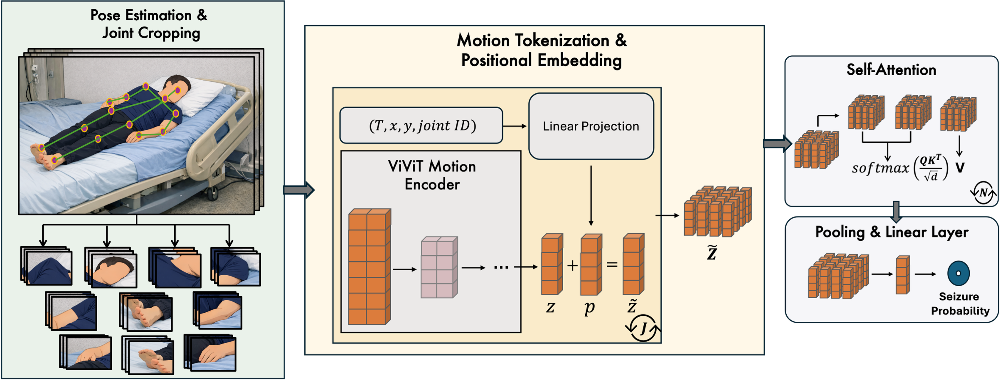

Learning Cross-Joint Attention for Generalizable Video-Based Seizure Detection
=============================================================================

**Official implementation** of [*Learning Cross-Joint Attention for
Generalizable Video-Based Seizure Detection*](https://arxiv.org/abs/2603.23757)
(arXiv:2603.23757).

This repository provides a documented Python implementation of a pose-aware
Video Vision Transformer (ViViT)-based seizure classifier with cross-joint attention.



- **Frozen ViViT + joint attention**: ViViT acts as a fixed video encoder; a
  transformer attends over per-joint tokens with positional information.
- **ViViT + LoRA finetuning**: an end-to-end variant with lightweight LoRA
  adapters on the last ViViT layers, trained jointly with the joint-attention
  classifier.


Package layout
--------------

- `seizure_classifier/`
  - `__init__.py`: package entry.
  - `data.py`: caching of joint tubelets and joint tokens from a clip-level
    dataframe, plus PyTorch datasets and collate functions. Does **not** include
    label/Excel parsing or video segmentation logic.
  - `pose.py`: lightweight OpenPose integration, clip sampling and decoding,
    joint-centered tubelets.
  - `models.py`: joint position embedder, joint transformer classifier, frozen
    ViViT token extractor, ViViT+LoRA builders, and end-to-end joint models.
  - `metrics.py`: NumPy implementations of AUROC, AUPRC, F1, etc.
  - `training_loops.py`: shared epoch loops used by the training scripts.
- `train_with_frozen_vivit.py`: train the joint-attention model with a frozen
  ViViT encoder.
- `train_with_vivit_finetuning.py`: train the joint-attention model while
  finetuning ViViT with LoRA.
- `model_weights/`: `pose.pth` and released frozen-ViViT classifier `.pt` files
  (with / without positional embedding; see `model_weights/README.md`).
- `clips_df_example.csv`: toy clip manifest showing the CSV columns used in
  training (dummy paths and values only).
- `requirements.txt`: core Python dependencies.


Installation
------------

Create a fresh environment (conda or venv) and install the dependencies:

```bash
# install pip inside the conda enviroment
conda install pip
# ensure it points to the conda environment 
which pip
# install the dependencies
pip install -r requirements.txt
```

The lightweight human pose estimation repository and a pose checkpoint are
also required:

```bash
git clone https://github.com/Daniil-Osokin/lightweight-human-pose-estimation.pytorch.git
```

Put **`pose.pth`** and any released classifier checkpoints under **`model_weights/`**
(the default `--pose_ckpt` is `model_weights/pose.pth` when you run from the repo
root). See **`model_weights/README.md`** for the classifier checkpoint format
(`best_thr` + `model` state dict) and inference loading notes.


Dataset preparation
-------------------

**Training data.** The models in this repository were trained on epileptic
monitoring unit video from **WU-SAHZU-EMU-Video**, hosted on Hugging Face:
[xuyankun/WU-SAHZU-EMU-Video](https://huggingface.co/datasets/xuyankun/WU-SAHZU-EMU-Video).
That release accompanies the VSViG work (ECCV 2024). The Hugging Face dataset card explains how videos are
released (including privacy masking). Download the data separately, run your
own preprocessing, and build a clip-level CSV in the format this code expects.

This code expects a clip-level dataframe (CSV) describing fixed-length segments
(typically 5 s). See **`clips_df_example.csv`** for a small illustration of the
schema (dummy paths and timestamps only).

**Required columns** for `--clips_csv` (used by the training scripts):

- `patient_id`: patient identifier (patient-wise splitting).
- `phase`: e.g. `interictal`, `transition`, `ictal` (only `interictal` and
  `ictal` are used for the binary task in the provided scripts).
- `video_path`: absolute or repo-relative path to the video file.
- `clip_start_s`, `clip_end_s`: clip start/end time in seconds.

**Optional extra columns** (ignored by `seizure_classifier` but useful when you
build the table from source videos, e.g. WU-SAHZU-style preprocessing):

- `seizure_id`, `clip_start`, `clip_end`, `eeg_onset`, `clinical_onset` (human-readable times),
  `eeg_onset_s`, `clinical_onset_s`, `video_duration_s`.

Constructing the full table from your dataset’s labels is left to
dataset-specific code outside this package.


Frozen ViViT + joint-attention classifier
-----------------------------------------

ViViT is frozen; per-joint tokens are precomputed, then a joint-level attention
model is trained.

1. **Precompute joint tokens and train**

```bash
python train_with_frozen_vivit.py \
  --clips_csv /path/to/clips_5s.csv \
  --cache_dir /path/to/cache_tokens \
  --pose_repo lightweight-human-pose-estimation.pytorch \
  --pose_ckpt model_weights/pose.pth \
  --device cuda \
  --val_frac 0.4 \
  --epochs 100 \
  --batch_size 8 \
  --lr 1e-4
```

The script:

- Loads the clip CSV and builds a patient-wise train/validation split.
- Runs pose estimation and builds joint-centered tubelets.
- Runs frozen ViViT (`google/vivit-b-16x2-kinetics400` by default) to obtain one
  token per joint.
- Caches `(tokens, pos, y)` to disk by default (skip with `--skip_cache` if the
  cache already exists).
- Trains the joint transformer classifier on cached tokens.
- Optional: `--disable_positional_emb` zeros positional inputs before the
  classifier.

Best checkpoint by validation AUPRC: `frozen_vivit_joint_clf_best.pt` under
`--cache_dir`.


ViViT + LoRA end-to-end finetuning
----------------------------------

Joint tubelets are cached; ViViT is finetuned with LoRA on the last layers while
the joint-attention head is trained end-to-end.

1. **Precompute tubelets and train end-to-end**

```bash
python train_with_vivit_finetuning.py \
  --clips_csv /path/to/clips_5s.csv \
  --cache_dir /path/to/cache_tubelets \
  --pose_repo lightweight-human-pose-estimation.pytorch \
  --pose_ckpt model_weights/pose.pth \
  --device cuda \
  --val_frac 0.4 \
  --epochs 200 \
  --batch_size 2 \
  --lr 1e-6 \
  --lora_last_n 8 \
  --lora_r 8 \
  --lora_alpha 16 \
  --lora_dropout 0.05
```

The script:

- Uses the same CSV and patient-wise split as above.
- Caches joint tubelets `(tubelets, pos, y)` for efficiency and reproducibility.
- Wraps ViViT with LoRA on the last `--lora_last_n` encoder layers.
- Uses a memory-efficient, joint-chunked ViViT forward with gradient
  checkpointing.
- Optional: `--disable_positional_emb` zeros positional inputs before the
  classifier.

Best checkpoint: `vivit_lora_joint_clf_best.pt` under `--cache_dir`.


Citing this repository / the paper
-----------------------------------

If you use this code or the method in your research, please cite the paper:

Zamzam, O., Medani, T., Chinara, C., & Leahy, R. (2026). Learning cross-joint
attention for generalizable video-based seizure detection. *arXiv preprint*
arXiv:2603.23757. [https://arxiv.org/abs/2603.23757](https://arxiv.org/abs/2603.23757)

```bibtex
@article{zamzam2026learning,
  title   = {Learning Cross-Joint Attention for Generalizable Video-Based Seizure Detection},
  author  = {Zamzam, Omar and Medani, Takfarinas and Chinara, Chinmay and Leahy, Richard},
  journal = {arXiv preprint arXiv:2603.23757},
  year    = {2026},
  url     = {https://arxiv.org/abs/2603.23757}
}
```


Reproducibility notes
---------------------

- Clip sampling and patient split use `--seed` in both training scripts.
- Metrics live in `seizure_classifier.metrics` (no scikit-learn dependency).
- Preprocessing defaults (e.g. clip length 5 s, downsampled fps 6) align with the
  experimental setup in the paper; adjust as needed for other datasets.

