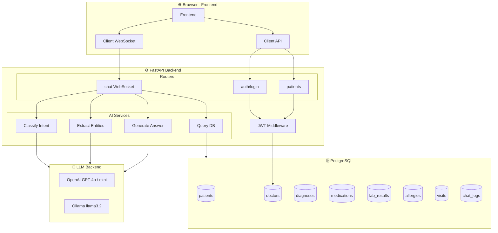
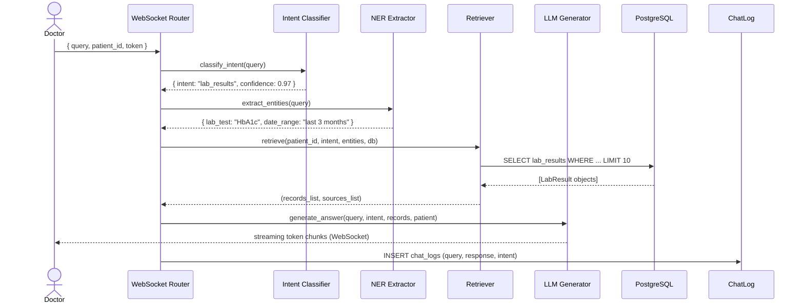

# 02 — System Architecture

## 2.1 High-Level Overview

The system follows a **3-tier architecture**: Frontend → Backend API → Database, with an additional **AI service layer** embedded within the backend.

```
┌─────────────────────────────────────────────────────────────────────────────┐
│                           DOCTOR'S BROWSER                                  │
│   ┌─────────────────────────────────────────────────────────────────────┐   │
│   │                   Single Page Application (HTML/JS)                 │   │
│   │  Login → Patient Search → Chat Interface (WebSocket streaming)      │   │
│   └────────────────────────┬────────────────────────────────────────────┘   │
└────────────────────────────│────────────────────────────────────────────────┘
                             │  HTTP REST + WebSocket (ws://)
                             ▼
┌──────────────────────────────────────────────────────────────────────────────┐
│                          FastAPI BACKEND (:8000)                             │
│                                                                              │
│  ┌──────────────┐  ┌───────────────────┐   ┌──────────────────────────────┐  │
│  │ /api/auth    │  │  /api/patients    │   │      /api/ws/chat            │  │
│  │  (JWT login) │  │  (CRUD + search)  │   │   (WebSocket message loop)   │  │
│  └──────┬───────┘  └────────┬──────────┘   └──────────────┬───────────────┘  │
│         │                   │                             │                  │
│         └──────────┬────────┘                ┌────────────▼─────────────┐    │
│                    │                         │       AI PIPELINE        │    │
│                    │     ┌───────────────────►  1. Intent Classifier    │    │
│                    │     │                   │  2. NER Extractor        │    │
│                    │     │                   │  3. DB Retriever         │    │
│                    ▼     │                   │  4. LLM Generator        │    │
│         ┌──────────────┐ │                   └──────────────────────────┘    │
│         │  SQLAlchemy  │ │                                                   │
│         │     ORM      │─┘                                                   │
│         └──────┬───────┘                                                     │
└────────────────│─────────────────────────────────────────────────────────────┘
                 │  SQL queries
                 ▼
┌──────────────────────────────────────────────────────────────────────────────┐
│                         PostgreSQL DATABASE                                  │
│   patients | doctors | visits | diagnoses | medications | lab_results        │
│   allergies | chat_logs                                                      │
└──────────────────────────────────────────────────────────────────────────────┘
                                        ▲
                                    (External)
                    ┌──────────────────────────────────────────┐
                    │   LLM Backend (configurable via .env)    │
                    │   Option A: OpenAI API (cloud)           │
                    │   Option B: Ollama  (local, private)     │
                    └──────────────────────────────────────────┘
```

---

## 2.2 Component Diagram



---

## 2.3 AI Pipeline — Detailed Flow

When a doctor sends a message, it passes through 4 sequential steps:



---

## 2.4 Directory Structure

```
Project/
├── .env                         # Environment variables (secrets, DB URL, LLM backend)
├── requirements.txt             # Python dependencies
├── Data/                        # Synthea CSV export files (18 files, ~2GB)
│   ├── patients_localized.csv
│   ├── conditions.csv
│   ├── medications.csv
│   ├── observations.csv
│   ├── allergies.csv
│   └── ...
├── backend/
│   ├── __init__.py
│   ├── main.py                  # FastAPI app, CORS middleware, router registration
│   ├── database.py              # SQLAlchemy engine + session factory
│   ├── models.py                # ORM table definitions (7 models)
│   ├── schemas.py               # Pydantic request/response models
│   ├── auth.py                  # JWT creation/validation, bcrypt password hashing
│   ├── seed.py                  # Dev seed: creates 1 doctor + 10 patients with full data
│   ├── load_synthea_csv.py      # Production import: loads Synthea CSVs into DB
│   ├── fix_blood_types.py       # Utility: back-fills blood_type on imported patients
│   ├── routers/
│   │   ├── auth.py              # POST /api/auth/login
│   │   ├── patients.py          # GET/POST /api/patients, GET /api/patients/{id}/...
│   │   └── chat.py              # POST /api/chat, WebSocket /api/ws/chat
│   └── services/
│       ├── intent.py            # LLM-based intent classification (8 classes)
│       ├── ner.py               # LLM-based medical NER (5 entity types)
│       ├── retriever.py         # Intent-aware PostgreSQL query builder
│       └── llm.py               # LLM answer generation with strict grounding prompt
├── frontend/
│   └── index.html               # Self-contained SPA (login, patient list, chat UI)
├── docs/                        # 📚 This documentation folder
│   ├── README.md
│   ├── 01_project_overview.md
│   ├── 02_system_architecture.md
│   ├── 03_api_reference.md
│   ├── 04_data_model.md
│   ├── 05_ai_pipeline.md
│   ├── 06_frontend_guide.md
│   ├── 07_setup_guide.md
│   ├── 08_benchmarks_and_evaluation.md
│   ├── 09_dataset_description.md
│   └── tests/
│       ├── test_intent.py
│       ├── test_ner.py
│       ├── test_retriever.py
│       ├── test_api.py
│       └── benchmark_pipeline.py
└── reference_docs/              # Original design documents (pre-project)
    ├── Local_LLM_Finetuning_Guide.docx
    ├── Medical_Chatbot_Architecture.docx
    ├── Medical_Chatbot_Step_By_Step_Guide.docx
    └── Synthea_Integration_And_Finetuning_Guide.docx
```

---

## 2.5 Security Architecture

| Mechanism | Implementation |
|-----------|----------------|
| Password storage | bcrypt hash via `passlib` |
| Session tokens | JWT (HS256) signed with SECRET_KEY from `.env` |
| Token expiry | Configurable (default: 60 minutes) |
| API protection | All endpoints except `/api/auth/login` require `Authorization: Bearer <token>` |
| Database | Credentials stored only in `.env`, never in source code |
| CORS | Configured in `main.py` (currently open `*` for dev; must be restricted in production) |

---

## 2.6 Deployment Architecture (Recommended)

```
[Nginx Reverse Proxy :80/:443]
         │
         ├──► /api/*  ──► FastAPI (Uvicorn :8000)
         │                         │
         │                         ├──► PostgreSQL :5432
         │                         └──► Ollama :11434 (local LLM)
         │
         └──► /*  ──► Static file serving (index.html)
```

---

*Next: [API Reference →](03_api_reference.md)*
