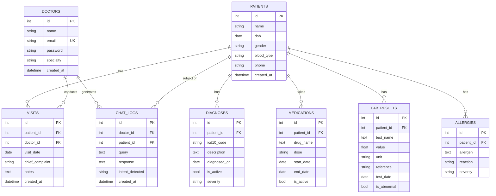

# 04 — Data Model

## 4.1 Entity Relationship Diagram



---

## 4.2 Table Descriptions

### `doctors`
Stores doctor accounts with bcrypt-hashed passwords. Only doctors can authenticate and access the system.

| Column | Type | Constraints | Notes |
|--------|------|-------------|-------|
| `id` | INTEGER | PK, auto-increment | |
| `name` | VARCHAR(100) | NOT NULL | Display name |
| `email` | VARCHAR(100) | UNIQUE, NOT NULL | Login credential |
| `password` | VARCHAR(200) | NOT NULL | bcrypt hash |
| `specialty` | VARCHAR(100) | nullable | Medical specialty |
| `created_at` | DATETIME | server default: NOW() | |

---

### `patients`
Core patient demographics. All medical data references this table.

| Column | Type | Constraints | Notes |
|--------|------|-------------|-------|
| `id` | INTEGER | PK, auto-increment | |
| `name` | VARCHAR(100) | NOT NULL | Full name |
| `dob` | DATE | nullable | Date of birth |
| `gender` | VARCHAR(10) | nullable | e.g. "Male", "Female" |
| `blood_type` | VARCHAR(5) | nullable | e.g. "O+", "AB-" |
| `phone` | VARCHAR(20) | nullable | Contact number |
| `created_at` | DATETIME | server default: NOW() | |

**Relationships:**
- Has many: `visits`, `diagnoses`, `medications`, `lab_results`, `allergies`

---

### `visits`

Clinical encounter records.

| Column | Type | Constraints | Notes |
|--------|------|-------------|-------|
| `id` | INTEGER | PK | |
| `patient_id` | INTEGER | FK → patients.id, NOT NULL | |
| `doctor_id` | INTEGER | FK → doctors.id | nullable (historical data) |
| `visit_date` | DATE | NOT NULL | |
| `chief_complaint` | VARCHAR(300) | nullable | Presenting complaint |
| `notes` | TEXT | nullable | Full clinical notes |
| `created_at` | DATETIME | server default | |

---

### `diagnoses`

ICD-10 coded diagnoses. Supports `is_active` flag to differentiate current vs. resolved conditions.

| Column | Type | Constraints | Notes |
|--------|------|-------------|-------|
| `id` | INTEGER | PK | |
| `patient_id` | INTEGER | FK → patients.id, NOT NULL | |
| `icd10_code` | VARCHAR(50) | nullable | e.g. "E11" for type 2 diabetes |
| `description` | TEXT | NOT NULL | Human-readable condition name |
| `diagnosed_on` | DATE | nullable | |
| `is_active` | BOOLEAN | default: True | Active vs. resolved |
| `severity` | VARCHAR(20) | nullable | mild / moderate / severe |

---

### `medications`

Prescription drugs with dosing and date tracking.

| Column | Type | Constraints | Notes |
|--------|------|-------------|-------|
| `id` | INTEGER | PK | |
| `patient_id` | INTEGER | FK → patients.id, NOT NULL | |
| `drug_name` | TEXT | NOT NULL | Brand or generic name |
| `dose` | VARCHAR(50) | nullable | e.g. "500mg twice daily" |
| `start_date` | DATE | nullable | Prescription start |
| `end_date` | DATE | nullable | NULL = still active |
| `is_active` | BOOLEAN | default: True | |

---

### `lab_results`

Laboratory test observations with value, unit, and reference range.

| Column | Type | Constraints | Notes |
|--------|------|-------------|-------|
| `id` | INTEGER | PK | |
| `patient_id` | INTEGER | FK → patients.id, NOT NULL | |
| `test_name` | TEXT | NOT NULL | e.g. "HbA1c", "Creatinine" |
| `value` | FLOAT | nullable | Numeric result |
| `unit` | VARCHAR(30) | nullable | e.g. "mg/dL", "%" |
| `reference` | VARCHAR(50) | nullable | Normal range string |
| `test_date` | DATE | NOT NULL | |
| `is_abnormal` | BOOLEAN | default: False | Flagged by lab system |

---

### `allergies`

Drug- and substance-based allergic reactions.

| Column | Type | Constraints | Notes |
|--------|------|-------------|-------|
| `id` | INTEGER | PK | |
| `patient_id` | INTEGER | FK → patients.id, NOT NULL | |
| `allergen` | TEXT | NOT NULL | Substance name |
| `reaction` | VARCHAR(200) | nullable | e.g. "Anaphylaxis", "Rash" |
| `severity` | VARCHAR(20) | nullable | mild / moderate / severe |

---

### `chat_logs`

Every query-response pair is logged for auditability and future fine-tuning.

| Column | Type | Constraints | Notes |
|--------|------|-------------|-------|
| `id` | INTEGER | PK | |
| `doctor_id` | INTEGER | FK → doctors.id | nullable (WebSocket path) |
| `patient_id` | INTEGER | FK → patients.id | nullable |
| `query` | TEXT | | Doctor's question |
| `response` | TEXT | | Full LLM answer |
| `intent_detected` | VARCHAR(50) | | Classified intent |
| `created_at` | DATETIME | server default | |

---

## 4.3 ORM Relationships Summary

```
Patient
  ├── visits      (one-to-many, back_populates='patient')
  ├── diagnoses   (one-to-many, back_populates='patient')
  ├── medications (one-to-many, back_populates='patient')
  ├── lab_results (one-to-many, back_populates='patient')
  └── allergies   (one-to-many, back_populates='patient')
```

All relationships use SQLAlchemy's lazy loading by default. When `PatientFullOut` is requested, all related data is eagerly loaded via the ORM relationship definitions.

---

## 4.4 Indexing Strategy

| Table | Indexed Columns | Reason |
| :--- | :--- | :--- |
| `patients` | `id` (PK) | All joins use patient_id |
| `doctors` | `id` (PK), `email` | Login lookup by email |
| `lab_results` | `test_date` | Date range filtering |
| `medications` | `is_active` | Most queries filter active only |

---

## 4.5 Doctor-Patient Assignment & Isolation

To comply with patient privacy regulations and clinical workflows, patient access is restricted based on assignment:
1. **Assignment Criteria:** A patient is considered assigned to a doctor if there is at least one record in the `visits` table linking the doctor (`doctor_id`) and the patient (`patient_id`).
2. **Access Control Filtering:**
   - **List Patients:** When a user with the `doctor` role queries `/api/patients`, the query dynamically joins the `visits` table and filters by `Visit.doctor_id == doctor.id`.
   - **Patient Details and Medical History:** Requests for specific patient history (medications, labs, diagnoses) verify that the doctor has an associated visit record for that patient. If not, the API returns a `403 Access Denied` or `404 Not Found` response.
   - **Nurse and Admin Roles:** Users authenticated as `nurse` or `admin` are exempt from this filter and can access all patient records globally for triage and system management.

---

*Next: [AI Pipeline →](05_ai_pipeline.md)*
