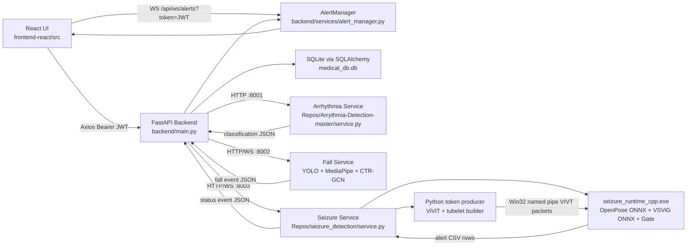
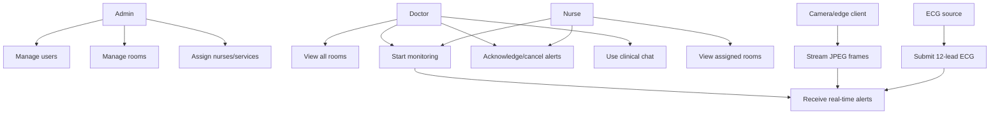
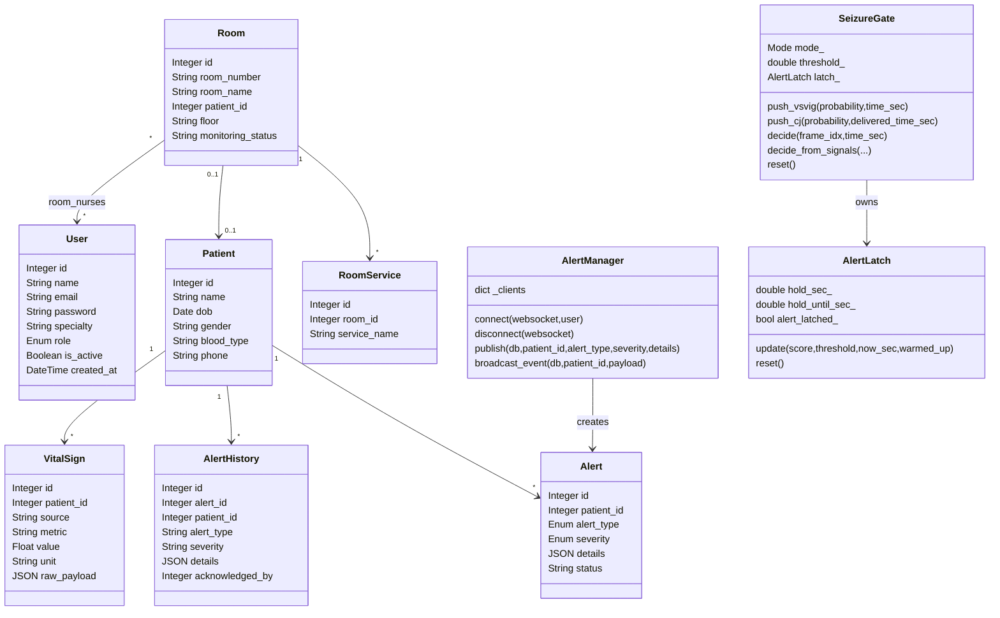
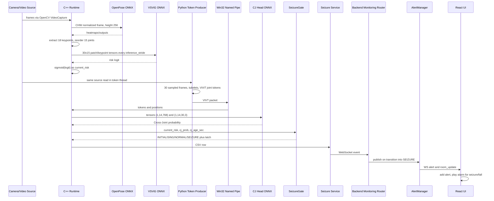
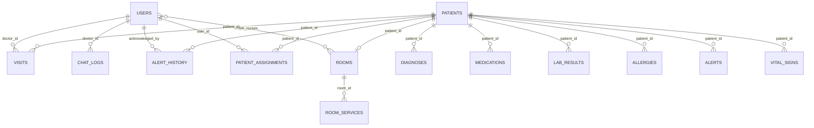

# Real-Time Hospital Monitor and Seizure Detection System

Graduation Project Thesis, Ain Shams University, Faculty of Computer and Information Sciences, 2026.

Authors: Ain Shams Graduation Project Team.

Supervisors: Supervisor Name, Teaching Assistant Name.

Codebase analyzed: `F:\GP\Deployment\Medical-History-Chatbot`.

Source-of-truth policy: this document was reverse-engineered from active source code, configuration files, dependency manifests, and machine-readable evaluation artifacts. Existing Markdown, Word documents, and text logs were not used as sources. Where a detail is logically inferred from endpoints or file structure, it is marked as an assumption.

## Executive Source Map

The repository implements a multi-service hospital monitoring platform. The main backend is a FastAPI application in `backend/main.py` with SQLAlchemy models in `backend/models.py`. The user interface is a Vite React application under `frontend-react/src`. Three inference services are embedded under `Repos`: arrhythmia detection in `Repos/Arrythmia-Detection-master/service.py`, fall detection in `Repos/Patient-fall-detection-system-main/service.py`, and seizure detection in `Repos/seizure_detection/service.py`. The seizure pipeline also contains a native C++ ONNX runtime under `Repos/seizure_detection/runtime`.

The system contains the following code-proven roles: `doctor`, `nurse`, and `admin`, defined by the `UserRole` enum in `backend/models.py` and enforced by `require_role` in `backend/auth.py`. Clinical alerts are typed as `arrhythmia`, `fall`, and `seizure`, and severities are typed as `low`, `medium`, `high`, and `critical`.

# Chapter 1: Introduction

## 1.1 Motivation

Hospital rooms require continuous observation when patients are at risk of seizures, falls, or cardiac rhythm abnormalities. The repository implements this requirement as a real-time monitoring platform in which bedside video, ECG arrays, role-aware staff dashboards, and persistent clinical alert logs are combined into one operational workflow. This motivation is substantiated by active code: the backend exposes monitoring endpoints in `backend/routers/monitoring.py`, real-time alert delivery is implemented by `backend/services/alert_manager.py`, and room-level clinical status is computed by `backend/routers/rooms.py`.

The clinical need is especially strong for high-risk neurology and emergency contexts, where a patient may transition from normal motor activity to a seizure or fall within seconds. The seizure runtime uses continuous frame processing, OpenPose keypoint extraction, VSViG inference, a ViViT/Cross-Joint side channel, and a 30-second alert latch. The fall service similarly keeps per-track skeleton buffers and latches alarms for 30 seconds after confirmed high-probability fall predictions. These mechanisms demonstrate that the project is designed to reduce missed events and to prevent alert flicker during sustained clinical episodes.

Manual clinical recording is error-prone when several rooms must be watched at once. The code therefore centralizes active alerts in the `alerts` table, moves acknowledged alerts into `alert_history`, and broadcasts changes through WebSockets. This design supports auditability and reduces dependence on manual note-taking during acute events.

## 1.2 Problem Definition

The problem addressed by the system is the continuous detection, persistence, and role-aware presentation of patient risk events in a hospital-room environment. The repository specifically addresses three signal classes: seizure-like motor manifestations in video, patient falls in room camera streams, and arrhythmia in 12-lead ECG signals. The central challenge is that these signals have different execution models. Seizure and fall detection are streaming workloads; arrhythmia detection is a request-response workload over a numeric ECG tensor.

The seizure pipeline also introduces a hybrid synchronous/asynchronous problem. The C++ runtime processes OpenPose and VSViG ONNX inference in the frame loop, while a Python sidecar builds ViViT joint tokens and writes them to a Win32 named pipe. The C++ runtime must then combine a current VSViG risk with the most recently delivered Cross-Joint probability without letting stale side-channel output drive alerts. This is reflected in `CJ_MAX_AGE_SEC = 5.5`, `GATE_UPPER_BOUND = 0.50`, `GATE_LOWER_BOUND = 0.20`, and `GATE_ALPHA = 0.30` in `Repos/seizure_detection/runtime/include/seizure_gate.hpp`.

False alert minimization is also a problem explicitly handled by code. Fall detection requires the fall probability to exceed `FALL_THRESHOLD = 0.90` and to appear in at least two consecutive predictions before an alarm becomes active. Seizure detection uses a series gate and a temporal latch. Arrhythmia detection only persists an alert when the stage-1 ECG model returns `Abnormal`.

## 1.3 Objective

The objective is to deliver a real-time hospital monitoring system that supports high-FPS edge inference, multiple monitoring services per room, secure staff interfaces, and persistent alert logging. The backend supports room services through `RoomService.service_name`, allowing each room to be configured with combinations such as `ecg`, `seizure`, and `fall`. Security is implemented by JWT-bearing requests and role-gated routers. Logging is implemented through active `Alert` records, permanent `AlertHistory` rows after acknowledgement, and service-specific CSV/runtime outputs for seizure monitoring.

The measured seizure runtime artifact `Repos/seizure_detection/runtime_outputs/current_10_demo_clinical_summary_2026-06-19.json` records a mean steady processing throughput of `37.21352` FPS across ten videos. This supports the real-time objective for approximately 30 FPS video sources. The same artifact reports mean token-building latency of `217.2843` ms, mean ViViT latency of `52.8346` ms, and mean Cross-Joint ONNX latency of `2.1589` ms.

## 1.4 Document Organization

Chapter 2 describes the scientific and systems background reflected in the implementation: pose estimation, graph convolution, video transformers, named pipes, ONNX Runtime, and web application architecture. Chapter 3 reconstructs the system analysis and design from code, including architecture, requirements, users, use cases, class diagrams, sequence diagrams, and the database schema. Chapter 4 documents implementation details and algorithms. Chapter 5 provides an operator and installation manual derived from scripts, services, and dependency manifests. Chapter 6 summarizes conclusions and future work constrained by the repository evidence.

# Chapter 2: Background

## 2.1 Skeleton-Based Human Pose Estimation

The seizure runtime uses an OpenPose-style model exported to ONNX at `Repos/seizure_detection/model_weights/pose.onnx`. In C++, `preprocess_openpose_frame` resizes frames to height 256 and normalizes BGR pixel channels using either ImageNet normalization or OpenPose normalization. Keypoints are extracted by `extract_openpose_keypoints`, which reads heatmap outputs, resizes heatmaps to frame-relative dimensions, and selects the maximum response for each of 18 channels if the confidence exceeds `min_kpt_conf`, whose default is `0.1`.

The fall service uses MediaPipe Pose rather than OpenPose. It crops a YOLO-tracked person box, converts the crop to RGB, extracts pose landmarks, maps MediaPipe landmarks to an NTU-25 skeleton through `mediapipe_to_ntu25`, and appends a 25-joint, three-channel frame to a fixed 72-frame buffer.

## 2.2 Graph Convolution and Spatiotemporal Transformers

The fall detector is based on CTR-GCN. The loaded model is constructed with `num_class=2`, `num_point=25`, `num_person=2`, `in_channels=3`, and graph `"graph.ntu_rgb_d.Graph"`. The input tensor shape after preprocessing is `(1, 3, 72, 25, 2)`: one batch, three coordinate channels, 72 time steps, 25 points, and two person streams where the second person is zero-filled by the service implementation.

The seizure detector combines a VSViG ONNX model and a ViViT/Cross-Joint branch. C++ VSViG inference uses a rolling 30-sample buffer of 15 selected joints. For each selected joint, a 128-pixel Gaussian-weighted region is reduced to a 32 by 32 patch. The resulting input tensor shape is `(1, 30, 15, 3, 32, 32)`, and the keypoint tensor shape is `(1, 30, 15, 3)`. The Python sidecar builds ViViT tubelets with `n_joints=14`, `patch_size=120`, and `sample_fps=6.0`, then serializes `(1, 14, 768)` token tensors and `(1, 14, 30, 3)` position tensors through a Win32 named pipe.

## 2.3 Systems Background

The seizure service uses a native and managed hybrid runtime. `Repos/seizure_detection/service.py` starts `seizure_runtime_cpp.exe` as a subprocess and starts an in-process Python token-producer thread for the same session. Communication between the two is performed through Win32 named pipes named as `\\.\pipe\seizure_vivit_tokens_{session_id}`. The binary packet begins with the magic header `VIVT`, followed by three `double` values (`time_sec`, `token_build_ms`, `vivit_ms`), followed by `14*768` float tokens and `14*30*3` float position values.

ONNX Runtime is used by the C++ runtime for OpenPose, VSViG, and the Cross-Joint head. The CMake file links ONNX Runtime and OpenCV libraries and copies CUDA and TensorRT provider DLLs, namely `onnxruntime_providers_cuda.dll` and `onnxruntime_providers_tensorrt.dll`, into the executable directory. The code sets graph optimization to `ORT_ENABLE_EXTENDED`.

The web system uses FastAPI `0.111.0`, Uvicorn `0.30.1`, SQLAlchemy `2.0.30`, HTTPX `0.27.0`, and WebSockets `12.0` according to `requirements.txt`. The frontend uses React `^18.3.1`, Vite `^5.3.1`, Zustand `^4.5.2`, Recharts `^2.12.7`, Axios `^1.7.2`, and React Router DOM `^6.24.0` according to `frontend-react/package.json`.

## 2.4 Existing Systems and Limitations

Traditional monitoring systems often rely on threshold-based alarms, single-signal device alarms, or manual camera observation. This repository implements a more integrated design: ECG, fall, and seizure inference results are normalized into one alert table and one WebSocket alert stream. The code still reveals limitations: nurse access is scoped to assigned rooms or legacy patient assignments, but doctor access is broadly open; `CORSMiddleware` currently allows all origins; and C++ seizure runtime mode is initialized as monitor mode even though the service accepts `safety`, `monitor`, and `screening`.

# Chapter 3: Analysis and Design

## 3.1 System Overview

## 3.1.1 System Architecture

The system is a distributed clinical monitoring application composed of four primary layers. The first layer is the React frontend under `frontend-react/src`, which authenticates users, renders role-specific dashboards, opens the alert WebSocket, and invokes backend REST endpoints. The second layer is the FastAPI backend under `backend`, which manages authentication, RBAC, patient data, rooms, alerts, chat, uploads, and dashboard summaries. The third layer consists of inference microservices for arrhythmia, fall, and seizure. The fourth layer is the native seizure runtime, which performs C++ ONNX inference and receives ViViT/Cross-Joint tokens from Python through a named pipe.



Data crosses system boundaries in three forms. REST JSON is used between the frontend and backend and between the backend and inference services. WebSocket messages are used for alert subscription, seizure event subscription, and fall camera streaming. A binary named-pipe protocol is used only inside the seizure service boundary between the C++ runtime and Python ViViT token producer.

## 3.1.2 Functional Requirements

The code proves the following functional requirements:

1. The system shall authenticate users by email and password and issue JWT access tokens from `/api/auth/login`.
2. The system shall enforce role-based access control for `doctor`, `nurse`, and `admin` roles.
3. The system shall list, create, and inspect patients and clinical sub-records.
4. The system shall support room CRUD operations, patient assignment, nurse assignment, and service assignment.
5. The system shall start, stop, and reset fall monitoring sessions.
6. The system shall start, stop, and reset seizure monitoring sessions.
7. The system shall accept ECG arrays of shape `(5000, 12)` and optional QRS feature vectors of length `7`.
8. The system shall create alerts for abnormal arrhythmia outputs, fall detections, and seizure transitions.
9. The system shall broadcast alerts, acknowledgements, cancellations, expirations, and room updates to connected WebSocket clients.
10. The system shall move acknowledged active alerts into `alert_history`.
11. The system shall provide dashboard summaries and service health states.
12. The system shall provide chat endpoints and streaming chat endpoints for clinical query workflows.

## 3.1.3 Non-Functional Requirements

Performance is addressed by model preloading, ONNX Runtime graph optimization, CUDA/TensorRT provider deployment, and rolling-window inference. The seizure runtime artifact records mean steady processing throughput of `37.21352` FPS, exceeding a 30 FPS camera rate in the measured ten-video set. Reliability is addressed by session health endpoints, startup warm-up in the seizure service, latch reset endpoints, and a 24-hour active-alert expiration loop that runs every 60 seconds. Security is implemented with bcrypt password hashing, JWT tokens using `HS256` by default, and router-level role gates. Scalability is supported by per-room fall sessions, per-session seizure processes, and service-specific HTTP clients.

Assumption: because the backend uses SQLite by default through `medical_db.db`, horizontal database scalability would require migration to a server database such as PostgreSQL for production hospital deployment.

## 3.1.4 System Users

The `admin` role manages users and rooms. Admin-only endpoints include creating rooms, updating rooms, assigning nurses, assigning services, and user activation/deactivation. The `doctor` role can access clinical dashboards, patients, room details, global chat, sandbox testing, and monitoring. The `nurse` role can access assigned rooms and patients, monitor alerts, and acknowledge clinical events. Nurse data access is explicitly filtered in `AlertManager._broadcast` and `rooms.list_rooms` by assigned room membership.

## 3.2 System Analysis and Design

## 3.2.1 Use Case Diagram and Scenarios



Fully dressed use case: Triggering and latching a seizure alarm. Primary actors are a doctor or nurse, the seizure service, and the alert WebSocket subscriber. Preconditions are that a patient exists, the user is assigned to the patient or has access, and `POST /api/monitoring/seizure/start` has been called. The backend starts a seizure session on port `8003`, then starts `_seizure_event_relay`. The seizure service launches `seizure_runtime_cpp.exe`, creates a Python token producer, and tails the C++ CSV. The C++ runtime emits `SEIZURE` when the series gate score exceeds the monitor threshold and the latch is active. On transition from non-seizure to seizure, the backend calls `alert_manager.publish` with `alert_type="seizure"` and `severity="critical"`. The alert is saved in `alerts`, a `room_update` is broadcast, and frontend subscribers receive the event. The failure path is service unreachability, represented by an error dict from `seizure_detection_client.start_session`.

Fully dressed use case: Acknowledging an alert. Primary actor is a doctor or nurse. The user calls `PATCH /api/dashboard/alerts/{alert_id}/acknowledge`. The backend creates an `AlertHistory` row with original alert data and `acknowledged_by`, deletes or removes the active alert, and broadcasts an acknowledgement event. The frontend `useAlertsWS` hook marks the alert as acknowledged in Zustand state.

Fully dressed use case: Assigning nurses to a room. Primary actor is an admin. The admin calls `POST /api/rooms/{room_id}/assign-nurses` with `nurse_ids`. The router verifies the room, filters users by `UserRole.nurse`, clears current relationships, extends `room.nurses`, commits the transaction, serializes the room, and broadcasts a room update.

## 3.2.2 Class Diagram



Major C++ classes are `SeizureGate` and `AlertLatch`. The prompt example mentions `GateFusion` and `PipeServer`, but those names do not exist in the active C++ code. The implemented equivalent is the free function `series_gate` and the named-pipe thread inside `full_runtime.cpp`.

## 3.2.3 Sequence Diagram



## 3.2.4 Database Diagram



Tables and exact columns are as follows:

`users`: `id Integer primary key`, `name String(100) not null`, `email String(100) unique not null index`, `password String(200) not null`, `specialty String(100)`, `role Enum(user_role) not null default doctor index`, `is_active Boolean default true not null`, `created_at DateTime server_default now`.

`patients`: `id Integer primary key`, `name String(100) not null`, `dob Date`, `gender String(10)`, `blood_type String(5)`, `phone String(20)`, `created_at DateTime server_default now`.

`visits`: `id Integer primary key`, `patient_id Integer foreign key patients.id not null`, `doctor_id Integer foreign key users.id`, `visit_date Date not null`, `chief_complaint String(300)`, `notes Text`, `created_at DateTime server_default now`.

`diagnoses`: `id Integer primary key`, `patient_id Integer foreign key patients.id not null`, `icd10_code String(50)`, `description Text not null`, `diagnosed_on Date`, `is_active Boolean default true`, `severity String(20)`.

`medications`: `id Integer primary key`, `patient_id Integer foreign key patients.id not null`, `drug_name Text not null`, `dose String(50)`, `start_date Date`, `end_date Date nullable`, `is_active Boolean default true`.

`lab_results`: `id Integer primary key`, `patient_id Integer foreign key patients.id not null`, `test_name Text not null`, `value Float`, `unit String(30)`, `reference String(50)`, `test_date Date not null`, `is_abnormal Boolean default false`.

`allergies`: `id Integer primary key`, `patient_id Integer foreign key patients.id not null`, `allergen Text not null`, `reaction String(200)`, `severity String(20)`.

`chat_logs`: `id Integer primary key`, `doctor_id Integer foreign key users.id`, `patient_id Integer foreign key patients.id`, `query Text`, `response Text`, `intent_detected String(50)`, `created_at DateTime server_default now`.

`alerts`: `id Integer primary key`, `patient_id Integer foreign key patients.id not null`, `alert_type Enum(alert_type) not null`, `severity Enum(alert_severity) not null default medium`, `details JSON`, `status String(20) default ACTIVE not null`, `created_at DateTime server_default now`.

`alert_history`: `id Integer primary key`, `alert_id Integer not null`, `patient_id Integer foreign key patients.id not null`, `alert_type String(50) not null`, `severity String(20) not null`, `details JSON`, `acknowledged_by Integer foreign key users.id`, `acknowledged_at DateTime`, `created_at DateTime not null`, `status String(20) default ACKNOWLEDGED not null`.

`vital_signs`: `id Integer primary key`, `patient_id Integer foreign key patients.id not null`, `source String(50) not null`, `metric String(50) not null`, `value Float`, `unit String(20)`, `raw_payload JSON`, `recorded_at DateTime server_default now`.

`patient_assignments`: `id Integer primary key`, `user_id Integer foreign key users.id not null`, `patient_id Integer foreign key patients.id not null`, `assigned_at DateTime server_default now`.

`rooms`: `id Integer primary key`, `room_number String(50) unique not null index`, `room_name String(100)`, `patient_id Integer foreign key patients.id`, `floor String(50)`, `monitoring_status String(50) default Idle not null`, `created_at DateTime server_default now`, `updated_at DateTime server_default now onupdate now`.

`room_services`: `id Integer primary key`, `room_id Integer foreign key rooms.id ondelete CASCADE not null`, `service_name String(50) not null`.

`room_nurses`: association table with composite primary key `room_id Integer foreign key rooms.id ondelete CASCADE` and `user_id Integer foreign key users.id ondelete CASCADE`.

# Chapter 4: Implementation

## 4.1 Function Descriptions

Frame preprocessing in seizure detection is implemented by `preprocess_openpose_frame`. It scales each frame to height 256, preserves aspect ratio, and writes a contiguous CHW float buffer. OpenPose keypoint extraction is implemented by `extract_openpose_keypoints`, which reads the second-last output tensor as heatmaps and locates the maximum response for each of the first 18 channels.

VSViG patch extraction is implemented by `extract_vsvig_patches`. It selects 15 joints with order `{0, 15, 14, 2, 3, 4, 5, 6, 7, 8, 9, 10, 11, 12, 13}`, creates a Gaussian-weighted 128 by 128 crop around each joint, resizes it to 32 by 32, and appends it to a 30-frame rolling buffer.

Named-pipe IPC is implemented by the C++ named-pipe thread and Python token producer. Python writes exactly one packet per ViViT segment: a four-byte magic header, three doubles, `14*768` floats, and `14*30*3` floats. C++ verifies `VIVT`, runs the Cross-Joint ONNX head, and pushes the delivered probability into a mutex-protected queue.

Series gate fusion is implemented by `series_gate`. If no Cross-Joint value exists, the gate returns `0.0` from `CJ_PENDING`. If `cj_prob >= 0.50`, the Cross-Joint probability is trusted directly. If `0.20 <= cj_prob < 0.50`, the score is `0.30*cj_prob + 0.70*vsvig_prob`. If `cj_prob < 0.20`, the Cross-Joint value is used as a low-risk suppressor. The temporal alert latch is implemented by `AlertLatch.update`, which holds a seizure state until `now_sec + 30.0` after a raw alarm.

Fall frame processing is implemented by `_process_frame` in the fall service. The function decodes a frame, runs YOLO person tracking, refreshes MobileNet role classification every 10 frames, extracts MediaPipe pose, maps to NTU-25, and runs CTR-GCN every 6 frames after a 72-frame buffer is full. A fall alarm requires probability at least `0.90` and two consecutive predictions before the latch is activated.

Arrhythmia inference is implemented by `_run_predict` in `Repos/Arrythmia-Detection-master/service.py`. The input signal must have shape `(5000, 12)` and optional `qrs7` shape `(7,)`. The service first applies a binary Normal/Abnormal model. If the result is Abnormal, a second model classifies `AF`, `IAVB`, `SB`, or `STach`.

## 4.2 Techniques and Algorithms

The seizure gate can be stated mathematically. Let `c` be the Cross-Joint probability and `v` be the VSViG probability. The gate score `g` is:

```text
if c is missing: g = 0
else if c >= 0.50: g = c
else if c >= 0.20: g = 0.30c + 0.70v
else: g = c
```

In monitor mode, an alarm is produced when `g >= 0.49`. In safety mode, the threshold is `0.88`. A held-out threshold constant `0.3081087228480716` exists in code but is not selected by `threshold_for`. The latch transforms the raw score into temporal status: before a Cross-Joint sample has been seen, status is `INITIALISING`; during and after a raw alarm, status is `SEIZURE` until the hold interval ends; otherwise status is `NORMAL`.

The fall preprocessing normalizes skeleton windows by subtracting the root joint and dividing by median length across selected bones `(0,1)`, `(1,2)`, `(2,3)`, `(0,12)`, and `(0,16)`. This makes the CTR-GCN input less dependent on body scale and camera distance. The second person stream is zero-filled, so the deployed service effectively performs single-patient fall inference while preserving the two-person tensor contract.

The ECG cascade uses softmax over model logits. The first model returns probabilities for `Normal` and `Abnormal`. The second model is executed only for abnormal records and returns softmax probabilities for `AF`, `IAVB`, `SB`, and `STach`. Backend severity is then mapped by `_arrhythmia_severity`: `AF` becomes `high`, `IAVB` becomes `medium`, confidence at least `0.90` becomes `high`, and all remaining abnormal classes become `medium`.

## 4.3 New Technologies

ONNX Runtime is used for native seizure inference, with OpenCV for video capture, image preprocessing, overlays, and output video writing. PyTorch is used by the fall service, the ECG service, and the seizure ViViT sidecar. FastAPI is used by all HTTP services, with WebSockets for streaming status and alerts. React is used for role-aware pages, React Router for route protection, Zustand for auth and alert state, Axios for HTTP, and Recharts for ECG visualization.

## 4.4 Evaluation Results Found in Repository

The seizure segment metrics report AUROC `0.9669`, AUPRC `0.9429`, accuracy `0.9128`, F1 `0.9018`, precision `0.8319`, recall `0.9845`, and threshold `0.3081087228480716` across `952` segments. The ten-video clinical runtime summary reports `6` successes, `1` early false alert, `3` late alerts, `0` misses, mean LEO `5.86055` seconds, mean LCO `-3.93945` seconds, FAR `5.3 / hr`, and mean steady FPS `37.21352`.

The fall CTR-GCN sliding-window evaluation reports `654` valid samples, accuracy `0.9159021406727829`, fall recall `0.9883495145631068`, fall F1 `0.9487418452935694`, macro F1 `0.85734964605104`, and ROC AUC `0.959768107843822`.

The MobileNet role classifier evaluation reports best validation accuracy `0.8092592592592592`, best validation macro F1 `0.7785515630313449`, selected checkpoint epoch `19`, and final validation patient F1 `0.85`.

The arrhythmia binary model reports accuracy `0.9609694521585458`, macro F1 `0.9342305405665805`, and AUROC macro OVR `0.9825567455320448` across `19805` samples. The abnormal subtype model reports accuracy `0.9491916859122402`, macro F1 `0.9470621466051721`, and AUROC macro OVR `0.9943177509816292` across `3464` samples.

# Chapter 5: User Manual

## 5.1 Operating Instructions

To use the system, a user signs in through `/login`. The frontend decodes the JWT payload and redirects the user to the appropriate route: `/doctor/dashboard`, `/nurse/dashboard`, or `/admin/dashboard`. Screenshot placeholder: login screen with email, password, and submit button.

Doctors use the dashboard and monitoring pages to inspect all rooms, view room risk, start monitoring sessions, open patient records, analyze ECG signals, and use clinical chat. Nurses use the dashboard and monitoring pages for assigned rooms and assigned patient records. Admins use user and room management screens to create staff accounts, configure rooms, bind patients, bind nurses, and assign enabled services.

Real-time alerts are received through `useAlertsWS`, which opens `WS_BASE/api/ws/alerts?token=<jwt>`. Alert events are added to a Zustand store and capped at 200 records. Seizure and fall alerts trigger an audio alarm that loops and automatically stops after 30 seconds. Acknowledge, cancel, and expire events mutate the local alert list without a page refresh.

For ECG testing, the backend exposes sandbox signal listing and signal retrieval endpoints under `/api/arrhythmia/sandbox`. Signal files are read from `F:/GP/Deployment/Medical-History-Chatbot/uploads/ECG_Signals`, resampled to 5000 samples, and submitted to the arrhythmia cascade.

## 5.2 Installation Guide

Backend installation uses Python dependencies from `requirements.txt`. The core versions are FastAPI `0.111.0`, Uvicorn `0.30.1`, SQLAlchemy `2.0.30`, Pydantic `2.7.1`, Python-Jose `3.3.0`, Passlib bcrypt `1.7.4`, HTTPX `0.27.0`, WebSockets `12.0`, and Pandas `2.2.2`. The `.env` file must define at least `SECRET_KEY`, `ALGORITHM`, `ACCESS_TOKEN_EXPIRE_MINUTES`, and service URLs when non-default ports are used.

Frontend installation uses `frontend-react/package.json`. Run `npm install`, then `npm run dev` for Vite development. Live mode requires `VITE_DATA_MODE=live`, `VITE_API_URL=http://localhost:8000`, and `VITE_WS_URL=ws://localhost:8000`. Otherwise, the UI uses mock data by default because `IS_MOCK` is defined as `import.meta.env.VITE_DATA_MODE !== 'live'`.

The seizure C++ runtime is built from `Repos/seizure_detection/runtime/CMakeLists.txt`. The build requires CMake `3.16` or newer, C++17, ONNX Runtime under `Repos/seizure_detection/third_party/onnxruntime`, and OpenCV libraries under `Repos/seizure_detection/third_party/vcpkg_installed/x64-windows`. The build creates `seizure_gate_replay` and `seizure_runtime_cpp`. Provider DLLs for ONNX Runtime CUDA and TensorRT are copied after build.

Model checkpoints must be placed exactly at the paths used by code: seizure `model_weights/pose.onnx`, `model_weights/vsvig_protogcn.onnx`, `model_weights/cj_final.onnx`, and `model_weights/pose.pth`; fall `model_weights/patient_detection_yolov8n.pt`, `model_weights/role_classification_mobilenetv3_best.pt`, and `model_weights/fall_motion_ctrgcn_72f_impact.pt`; arrhythmia `models/binary_normal_abnormal/checkpoints/best.pt` and `models/abnormal_subtype/checkpoints/best.pt`.

Services run on these code-defined defaults: main backend port `8000` by deployment convention, arrhythmia service port `8001`, fall service port `8002`, and seizure service port `8003`. The repository includes `start_all_services.ps1` and `start_all_services.sh`; these scripts were recognized as runtime entry points but were not used as thesis sources for architectural claims beyond service startup existence.

# Chapter 6: Conclusions and Future Work

## 6.1 Conclusions

The repository implements a functional multi-modal hospital monitoring system with role-based staff access, room-centered operations, persistent clinical alerts, and streaming AI inference services. The seizure subsystem demonstrates a hybrid high-performance architecture, combining native ONNX inference with Python ViViT token extraction and a mathematically simple series gate. The fall subsystem demonstrates a stateful per-room WebSocket design with object tracking, role filtering, skeleton extraction, and CTR-GCN motion recognition. The arrhythmia subsystem demonstrates a two-stage ECG cascade with persistent alert integration.

The strongest measured real-time evidence is the seizure clinical runtime summary, which reports a mean steady throughput of `37.21352` FPS and a mean Cross-Joint ONNX head time of `2.1589` ms. The strongest classification evidence is distributed across artifacts: seizure AUROC `0.9669`, fall ROC AUC `0.9598`, ECG binary AUROC `0.9826`, and ECG subtype AUROC `0.9943`.

## 6.2 Future Work

Future work should migrate the backend database from SQLite to a production RDBMS, constrain CORS origins, and align doctor access with explicit ward or room scopes. The seizure service should propagate the requested mode into the C++ runtime rather than always constructing `SeizureGate` in monitor mode. The named-pipe runtime should expose a structured health signal for stale or missing Cross-Joint packets. The fall service should evaluate multi-patient room scenarios because the deployed tensor currently zero-fills the second-person stream. Cross-site clinical validation and domain adaptation should be performed for hospital-specific cameras, lighting, bed layouts, and patient populations. Edge deployment could be improved by quantizing ONNX models and replacing heavy ViViT components with lighter backbones when the measured latency budget requires it.

# References

[1] Z. Cao, T. Simon, S.-E. Wei, and Y. Sheikh, "Realtime Multi-Person 2D Pose Estimation using Part Affinity Fields," CVPR, 2017.

[2] K. Chen et al., "Channel-wise Topology Refinement Graph Convolution for Skeleton-Based Action Recognition," ICCV, 2021.

[3] A. Arnab et al., "ViViT: A Video Vision Transformer," ICCV, 2021.

[4] Google Research, "MediaPipe: A Framework for Building Perception Pipelines," 2019.

[5] Ultralytics, "YOLOv8," software framework used by the fall detection service.

[6] Microsoft, "ONNX Runtime," native inference runtime used by the seizure C++ executable.

[7] FastAPI documentation and framework source, web API framework used by all Python services.

[8] React, React Router, Zustand, Axios, and Recharts project documentation, frontend libraries used by `frontend-react/package.json`.

## BibTeX

```bibtex
@inproceedings{cao2017openpose,
  title={Realtime Multi-Person 2D Pose Estimation using Part Affinity Fields},
  author={Cao, Zhe and Simon, Tomas and Wei, Shih-En and Sheikh, Yaser},
  booktitle={CVPR},
  year={2017}
}

@inproceedings{chen2021ctrgcn,
  title={Channel-wise Topology Refinement Graph Convolution for Skeleton-Based Action Recognition},
  author={Chen, Yuxin and Zhang, Ziqi and Yuan, Chunfeng and Li, Bing and Deng, Ying and Hu, Weiming},
  booktitle={ICCV},
  year={2021}
}

@inproceedings{arnab2021vivit,
  title={ViViT: A Video Vision Transformer},
  author={Arnab, Anurag and Dehghani, Mostafa and Heigold, Georg and Sun, Chen and Lucic, Mario and Schmid, Cordelia},
  booktitle={ICCV},
  year={2021}
}

@misc{onnxruntime,
  title={ONNX Runtime},
  author={{Microsoft}},
  howpublished={Software},
  year={2026}
}

@misc{fastapi,
  title={FastAPI},
  author={Ramirez, Sebastian},
  howpublished={Software framework},
  year={2026}
}
```

# Appendix A: Code Evidence Index

Backend entry point: `backend/main.py`. Authentication and RBAC: `backend/auth.py`. Database schema: `backend/models.py`. Monitoring router: `backend/routers/monitoring.py`. Room router: `backend/routers/rooms.py`. Alert manager: `backend/services/alert_manager.py`. Seizure backend client: `backend/services/seizure_detection_client.py`. Arrhythmia router: `backend/routers/arrhythmia.py`. Frontend routes: `frontend-react/src/App.jsx`. Alert WebSocket hook: `frontend-react/src/hooks/useAlertsWS.js`. Alert store: `frontend-react/src/store/alertsStore.js`. Seizure C++ gate: `Repos/seizure_detection/runtime/include/seizure_gate.hpp`. Seizure C++ runtime: `Repos/seizure_detection/runtime/src/full_runtime.cpp`. Seizure service: `Repos/seizure_detection/service.py`. ViViT IPC server: `Repos/seizure_detection/runtime/vivit_ipc_server.py`. Fall service: `Repos/Patient-fall-detection-system-main/service.py`. Arrhythmia service: `Repos/Arrythmia-Detection-master/service.py`.
