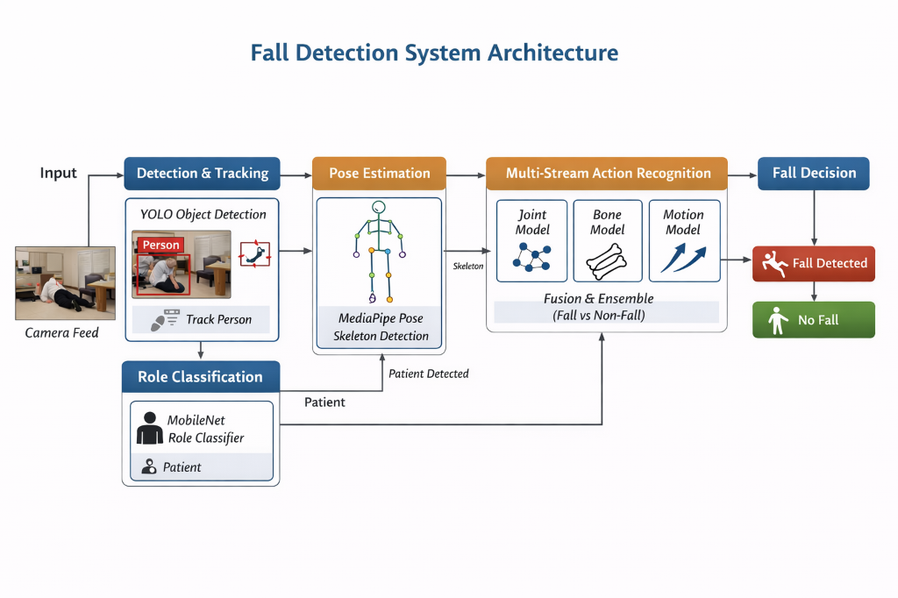

# Patient Fall Detection System

This repository is the final organized package for a patient fall detection project. It contains the runtime files, training code, evaluation code, evaluation results, and updated model weights required to reproduce the final system without including raw datasets.

The system combines four model stages:

1. Person detection and tracking with YOLOv8.
2. Role classification with MobileNetV3-Large.
3. Pose extraction with MediaPipe.
4. Fall motion classification with CTR-GCN.



## Repository Structure

```text
FallDetection_Final/
|-- README.md
|-- requirements.txt
|-- system_diagram.png
|-- runtime/
|   |-- README_RUNTIME.md
|   |-- real_time_fall_detection_pipeline.py
|   |-- patient_detection_tracking.py
|   |-- pose_motion_classification.py
|   |-- role_classifier.py
|   |-- ctrgcn_model.py
|   |-- mediapipe_functions.py
|   `-- graph/
|-- model_weights/
|   |-- patient_detection_yolov8n.pt
|   |-- role_classification_mobilenetv3_best.pt
|   |-- role_classification_mobilenetv3_config.yaml
|   `-- fall_motion_ctrgcn_72f_impact.pt
|-- training/
|   |-- patient_detection_yolo/
|   |-- role_classification_mobilenetv3/
|   |-- pose_preprocessing_mediapipe/
|   `-- fall_motion_ctrgcn/
|-- evaluation/
|   |-- scripts/
|   `-- results/
`-- runtime_outputs/
```

## Environment Setup

Create and activate a Python environment, then install the dependencies:

```powershell
cd <your-repo-root>/services/fall_detection
python -m venv .venv
.\.venv\Scripts\Activate.ps1
pip install -r requirements.txt
```

If you use a CUDA-enabled GPU, install the PyTorch build that matches your CUDA version before running training or inference.

## Final Runtime Pipeline

The main runtime file is:

```text
runtime/real_time_fall_detection_pipeline.py
```

It accepts a webcam, video file, or stream URL. For each frame, it detects people, tracks identities, classifies the person role, extracts patient pose, buffers the latest 72 skeleton frames, and runs CTR-GCN fall classification.

Run from webcam:

```powershell
python runtime\real_time_fall_detection_pipeline.py --source 0
```

Run from a video file:

```powershell
python runtime\real_time_fall_detection_pipeline.py --source "path\to\video.mp4" --output runtime_outputs\full_pipeline.mp4
```

See [runtime/README_RUNTIME.md](runtime/README_RUNTIME.md) for detailed real-time behavior, options, FPS logging, and model flow.

## Runtime Stages

### 1. Patient Detection and Tracking

Runtime file:

```text
runtime/patient_detection_tracking.py
```

This stage uses YOLOv8 to detect people and Ultralytics tracking to keep IDs across frames. It can optionally run the MobileNetV3 role classifier on each detected crop.

Default weight:

```text
model_weights/patient_detection_yolov8n.pt
```

Run:

```powershell
python runtime\patient_detection_tracking.py --video "path\to\input_video.mp4"
```

### 2. Role Classification

Runtime module:

```text
runtime/role_classifier.py
```

The role classifier is a MobileNetV3-Large model trained to classify detected person crops into:

- `medical_staff`
- `other`
- `patient`

Default weight:

```text
model_weights/role_classification_mobilenetv3_best.pt
```

### 3. Pose Estimation

Runtime module:

```text
runtime/mediapipe_functions.py
```

MediaPipe extracts 33 body landmarks from the selected person crop. The landmarks are mapped to the 25-joint NTU-style skeleton used by CTR-GCN.

### 4. Fall Motion Classification

Runtime files:

```text
runtime/pose_motion_classification.py
runtime/ctrgcn_model.py
runtime/graph/
```

The final updated CTR-GCN model uses 72-frame impact-centered skeleton windows. At 18 FPS, 72 frames represent approximately 4 seconds of motion.

Updated final weight:

```text
model_weights/fall_motion_ctrgcn_72f_impact.pt
```

## Training Code

The `training/` folder contains the code used for each trained component.

### Patient Detection YOLO

Folder:

```text
training/patient_detection_yolo/
```

Includes code for YOLO-based detection sanity checks and pseudo-label dataset building.

### MobileNetV3 Role Classification

Folder:

```text
training/role_classification_mobilenetv3/
```

Includes:

- `train_mobilenet_roles.py`
- `MobileNetFinetuning.ipynb`
- `config_used.yaml`
- `history.json`

### MediaPipe Pose Preprocessing

Folder:

```text
training/pose_preprocessing_mediapipe/
```

Includes skeleton extraction and joint-mapping code used to convert pose landmarks to the CTR-GCN skeleton format.

### CTR-GCN Fall Motion Classification

Folder:

```text
training/fall_motion_ctrgcn/
```

Includes:

- CTR-GCN source code
- HAR-UP/UP-Fall configs
- preprocessing scripts
- the 72-frame impact-centered preprocessing script

The final training setup used:

- 72 frames per sample
- 18 FPS sampling target
- 2 seconds before impact and 2 seconds after impact
- impact localization from synchronized IMU acceleration peaks
- labels: `non_fall` and `fall`

The final CTR-GCN training output selected epoch 20:

```text
model_weights/fall_motion_ctrgcn_72f_impact.pt
```

## Evaluation Code

Evaluation scripts are in:

```text
evaluation/scripts/
```

Included scripts:

- `evaluate_patient_detection_yolo.py`
- `evaluate_role_classification_mobilenetv3.py`
- `evaluate_fall_motion_sliding_windows_72f.py`
- `visualize_imu_impact_window.py`
- `visualize_realtime_windowing.py`

## Evaluation Results

Evaluation outputs are kept in:

```text
evaluation/results/
```

### CTR-GCN 72-Frame Sliding-Window Evaluation

Folder:

```text
evaluation/results/fall_motion_ctrgcn_72f_sliding_window/
```

Main result at threshold `0.50`:

- Samples: 655
- Valid samples: 654
- No-pose samples: 1
- Accuracy: 91.59%
- Fall precision: 91.22%
- Fall recall: 98.83%
- Fall F1: 94.87%
- ROC AUC: 95.98%

Confusion matrix:

| True \ Predicted | non_fall | fall |
|---|---:|---:|
| non_fall | 90 | 49 |
| fall | 6 | 509 |

The threshold sweep showed that higher thresholds reduce false positives on long non-fall videos. For example, threshold `0.95` reached 93.27% accuracy with 34 false positives and 10 missed falls.

### MobileNetV3 Role Classification Evaluation

Folder:

```text
evaluation/results/role_classification_mobilenetv3/
```

Includes:

- confusion matrix
- normalized confusion matrix
- training history
- training config
- metrics summary

Updated Run 3 validation results:

- Best validation accuracy: 80.93% at epoch 25
- Best validation macro F1: 77.86% at epoch 19
- Best validation weighted F1: 81.36% at epoch 29
- Last recorded epoch: 29
- Last epoch validation accuracy: 80.93%

### YOLO Patient Detection Evaluation

Folder:

```text
evaluation/results/patient_detection_yolo/
```

The final package does not include raw labeled detection datasets. The included evaluation script reports video-level detector sanity metrics such as no-detection frame rate and mean confidence.

### Runtime Visualizations

Folder:

```text
evaluation/results/runtime_visualizations/
```

Includes rendered videos used to visualize IMU-centered fall-window selection and real-time windowing behavior.

## Model Weights

Updated final weights are in:

```text
model_weights/
```

| File | Purpose |
|---|---|
| `patient_detection_yolov8n.pt` | YOLOv8 person detector |
| `role_classification_mobilenetv3_best.pt` | MobileNetV3 role classifier |
| `role_classification_mobilenetv3_config.yaml` | saved role-classifier config |
| `fall_motion_ctrgcn_72f_impact.pt` | final updated CTR-GCN fall model |

## Notes

- Raw datasets are intentionally excluded.
- Runtime-generated videos/logs should go to `runtime_outputs/`.
- Evaluation caches are not included.
- The final repository is organized for GitHub upload and project demonstration.
