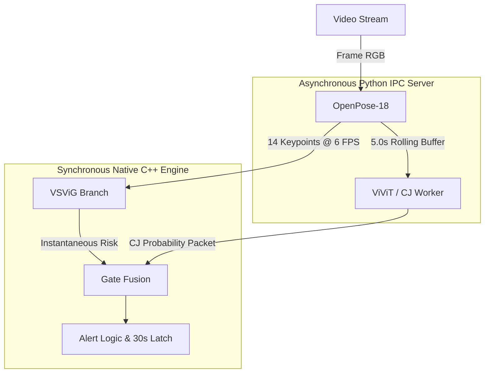

# Real-Time Seizure Detection

Video-based seizure detection from an EMU bed camera. The system fuses a lightweight VSViG temporal branch with an async Cross-Joint / ViViT classifier through a series gate, producing two clinical alert states — **NORMAL** and **SEIZURE** — with a configurable alert latch.

---

## Project Overview

**Project Goal:** To provide a robust, real-time video-based seizure detection system that operates continuously in an Epilepsy Monitoring Unit (EMU).
**Objective:** Detect motor manifestations of seizures (e.g., focal and generalized tonic-clonic) reliably while maintaining a high frame rate and minimizing false alerts.
**Deployment Architecture:** A hybrid C++/Python deployment. The high-frequency processing (video decoding, OpenPose, VSViG inference, and series gate logic) runs natively in C++ via ONNX Runtime to guarantee real-time performance. The heavy asynchronous ViViT processing runs in a parallel Python process, receiving clips via Inter-Process Communication (IPC).
**Evaluation Architecture:** A suite of Python scripts to measure segment-level AUROC/AUPRC and clinical event timings (Latency to EEG Onset [LEO] and Latency to Clinical Onset [LCO]).

---

## Pipeline Architecture Details

The pipeline processes video continuously at a steady-state rate of ~37 FPS (on an RTX 4060/5060 equivalent), achieved through highly optimized asynchronous threading.



### Detailed Component Execution

1. **Frame Acquisition:** OpenCV `VideoCapture` streams frames at their native frame rate (typically ~30 FPS). The C++ engine selectively evaluates frames to match the desired sampling rate (`vsvig_sample_fps`, default 6.0).
2. **OpenPose-18:** The active frames are resized and passed into the OpenPose ONNX graph, producing heatmaps and Part Affinity Fields (PAFs). These are decoded into a strictly ordered set of 14 clinically relevant skeleton keypoints.
3. **VSViG Branch (Spatial-Temporal Graph):** A lightweight Graph Convolutional Network processes the live keypoints instantly to produce a local seizure risk score (`current_risk`). Because this model is extremely fast (~2.5ms), it runs synchronously inline.
4. **ViViT/CJ Worker (IPC Pipeline):** The C++ engine aggregates the past 5.0 seconds of keypoints into a fixed-size byte buffer. This buffer is pushed asynchronously to a Windows Named Pipe (`\\.\pipe\seizure_vivit_tokens`). The isolated Python server wakes up, ingests the data, passes it through the massive ViViT transformer, runs the Cross-Joint (CJ) final classification head (`cj_final.onnx`), and passes the resulting float score back to C++.
5. **Series Gate & Latch:** The C++ `GateFusion` module looks at the most recently delivered CJ score. If the score is highly confident, it is trusted. If it is mixed, it blends the CJ score with the live VSViG risk. If the blended score crosses the active clinical threshold (e.g., `0.49`), an alarm triggers, and a **30-second temporal latch** holds the alarm active.

**Degraded Mode:** If the Python IPC Server crashes or lags significantly (CJ age > 5.5s), the C++ engine seamlessly falls back to 100% VSViG reliance without blocking or crashing the main monitoring loop.

---

## Repository Structure

```text
seizure_detection/
├── README.md                           ← This file
├── requirements.txt                    ← Python dependencies
├── vcpkg.json                          ← C++ package dependencies
├── configs/
│   └── default.yaml                    ← Centralized model paths, thresholds, and buffer configs
├── evaluation/
│   ├── evaluate_runtime.py             ← Clinical timing (LEO/LCO) & FPS profiling
│   └── evaluate_segments.py            ← Classification metrics (AUROC, AUPRC)
├── model_weights/                      ← Local model path (optional; models auto-resolved from
│                                          models/seizure/ in the monorepo — see model_weights/README.md)
├── runtime/
│   ├── CMakeLists.txt                  ← Native C++ build configuration
│   ├── vivit_ipc_server.py             ← Python ViViT asynchronous IPC server
│   ├── include/seizure_gate.hpp        ← Series gate, threshold logic, and latch implementation
│   └── src/full_runtime.cpp            ← Main native C++ ONNX execution engine (Win32)
├── sample_videos/                      ← Ground truth test demo clips (.mp4)
├── third_party/                        ← Pre-compiled C++ dependencies (ONNX Runtime, OpenCV via vcpkg)
│   ├── onnxruntime/                    ← ONNX Runtime headers + import libraries
│   ├── opencv_vcpkg_manifest/          ← OpenCV vcpkg manifest (vcpkg.json for OpenCV build)
│   └── vcpkg_installed/                ← OpenCV compiled libraries (x64-windows)
and the vendored Python code lives at the repository root:
  third_party/
  ├── joint-attention-seizure-detection/   ← ViViT + CJ seizure classifier code
  └── lightweight-human-pose-estimation.pytorch/  ← OpenPose Python model code
└── runtime_outputs/                    ← Logs, CSVs (auto-created on execution)
```

---

## Hardware Requirements

**Minimum Hardware:**
* **GPU:** NVIDIA GPU with 6GB+ VRAM (e.g., RTX 3060). Required for ONNX Runtime CUDA execution provider.
* **CPU:** 4-core modern Intel/AMD processor (Needed for bounding box / OpenCV heuristics).
* **RAM:** 16 GB DDR4.
* **Disk:** 5 GB free space (SSD strongly recommended due to large ViViT checkpoint loading).

**Recommended Hardware:**
* **GPU:** NVIDIA RTX 4070 / RTX 5060 Laptop (8GB+ VRAM). Guarantees ~40 FPS.
* **CPU:** 8-core processor.
* **RAM:** 32 GB.

**Expected Runtime Speed:** ~37.2 FPS (steady-state on recommended hardware).
**Known Limitations:** Heavy CPU/VRAM usage during ViViT model loading initialization (approx. 10 seconds startup delay).

---

## Software Requirements & Prerequisites

Ensure the following system dependencies are fully installed before beginning setup:

* **OS:** Windows 10/11 64-bit (Due to Windows Named Pipe IPC usage).
* **Python:** 3.10+ (Tested extensively on 3.12 via Miniconda).
* **Visual Studio:** Visual Studio 2022 (Ensure 'Desktop development with C++' and 'MSVC v143 build tools' are checked).
* **CMake:** Version 3.16 or higher added to your system `PATH`.
* **CUDA Toolkit / cuDNN:** CUDA 11.8 or 12.x installed system-wide. *Ensure `nvcc` is available in your PATH.*
* **ONNX Runtime:** Version 1.23.0+ (`onnxruntime-gpu` for python, provided via `third_party/` for C++).
* **PyTorch:** Version 2.1.0+ (`torch`, `torchvision`).
* **HuggingFace Transformers:** Version 4.38.0+.
* **OpenCV:** Version 4.8.0+.

---

## Environment Setup & Implementation Guide

### 1. Clone the Repository (Monorepo)

This service is part of the **Shifaa monorepo**. Clone the main repository — do **not**
clone `omarsalama4/Seizure-Detection` separately (that is the standalone research repo).

```powershell
git clone https://github.com/omarelnokrashy/Shifaa-AI-Based-Patient-Monitoring-System.git
cd Shifaa-AI-Based-Patient-Monitoring-System
```

The vendored Python modules (`joint-attention-seizure-detection` and
`lightweight-human-pose-estimation.pytorch`) are checked in under `third_party/`
in the repository root and are automatically on the path at runtime.

### 2. Python Environment Setup
Create an isolated Conda environment to avoid conflicting PyTorch CUDA versions.
```powershell
conda create -n seizure_env python=3.10
conda activate seizure_env
pip install -r requirements.txt
```

### 3. C++ Dependencies (Third Party)

The C++ runtime requires pre-compiled third-party libraries (ONNX Runtime and OpenCV).

**Option A: Windows Users (Recommended Fast Path)**

The pre-compiled libraries are included in the repository under `third_party/`:

```text
services/seizure_detection/third_party/
├── onnxruntime/          ← ONNX Runtime 1.23.2 headers + import libraries
├── opencv_vcpkg_manifest/ ← OpenCV vcpkg manifest
└── vcpkg_installed/      ← Pre-compiled OpenCV libs (x64-windows)
```

If the `third_party/` directory is **not** present (e.g., it was excluded from your
git history), download the pre-compiled bundle from the
[Third Party Drive Link](https://drive.google.com/drive/folders/1EhASZeiC5s5ads-luZJwHTpH79ckymg7?usp=sharing)
and extract so the structure exactly matches the above.

**Option B: Manual Installation via VCPKG**

If you are on a different OS or prefer to compile from source:

1. `git clone https://github.com/microsoft/vcpkg.git`
2. `./vcpkg/bootstrap-vcpkg.bat` (Windows) or `./vcpkg/bootstrap-vcpkg.sh`
3. `./vcpkg/vcpkg install opencv4 --triplet x64-windows`
4. Download ONNX Runtime from [GitHub Releases](https://github.com/microsoft/onnxruntime/releases)
   and place the extracted contents into `third_party/onnxruntime`.

### 4. Required Files & Model Checkpoints

All model files are stored at the **repository root** under `models/seizure/` and are
automatically resolved by the service and evaluation scripts when run from the
standard monorepo layout. **You do not need to copy anything into `model_weights/`.**

```text
Medical-History-Chatbot/
└── models/
    └── seizure/
        ├── pose.onnx          (280 KB header + pose.onnx.data 15.6 MB)
        ├── pose.pth           (47.1 MB — PyTorch fallback)
        ├── vsvig_protogcn.onnx (+ vsvig_protogcn.onnx.data)
        ├── cj_final.onnx     (+ cj_final.onnx.data)
        └── ...data files
```

If the `models/seizure/` directory is missing, contact the repository maintainer
for the model files (they are too large for GitHub but are committed via Git LFS
or must be obtained from the project team).

For the **model_weights/** directory (used only when running scripts standalone),
see `services/seizure_detection/model_weights/README.md`.

### 5. Environment Variables (HuggingFace / ViViT)

The service uses **smart offline detection** — you do not need to set any environment
variables manually. On the **first run**, the service downloads
`google/vivit-b-16x2-kinetics400` from HuggingFace automatically (~300 MB).
On all subsequent runs it uses the local cache.

For convenience, run the dedicated download script before starting the service:
```powershell
python scripts\download_vivit.py
```

For **air-gapped / offline-only** deployments, pre-populate the HuggingFace cache
on a machine with internet access and copy the cache directory to the target machine:
```text
~/.cache/huggingface/hub/models--google--vivit-b-16x2-kinetics400/
```
Then set `HF_HUB_OFFLINE=1` and `TRANSFORMERS_OFFLINE=1` in `.env` — the service
will detect the cache and enforce offline mode automatically.

### 6. Sample Videos
Download the proprietary `pat*.mp4` sample videos into the `sample_videos/` folder from the [Sample Videos Drive Link](https://drive.google.com/drive/folders/1RjK-vHeSD_NFbk2HMjD6iusjOAOhxiDx). The `evaluate_runtime.py` script specifically looks for `pat03_Sz1PG_demo_good.mp4`, `pat04_Sz1P_demo_good.mp4`, etc.

---

## Build Instructions (C++ Runtime)

Build the C++ ONNX native runtime via CMake. 

**If you used Option A (Pre-compiled Windows Dependencies):**
Because we are using the pre-compiled `third_party` folder, you do not need to pass any toolchain files.
```bash
cd runtime
mkdir build
cd build
cmake .. -DCMAKE_BUILD_TYPE=Release
cmake --build . --config Release
```

**If you used Option B (VCPKG Manual Installation):**
You must point CMake to your VCPKG toolchain file so it can find your newly compiled OpenCV.
```bash
cd runtime
mkdir build
cd build
cmake .. -DCMAKE_TOOLCHAIN_FILE="<absolute-path-to-vcpkg>/scripts/buildsystems/vcpkg.cmake" -DCMAKE_BUILD_TYPE=Release
cmake --build . --config Release
```

**Expected Artifact:** The executable `seizure_runtime_cpp.exe` will be generated in `runtime/build/Release/`. The CMake post-build step will automatically copy the required `onnxruntime.dll`, `onnxruntime_providers_cuda.dll`, and OpenCV DLLs alongside the executable.

---

## Runtime Parameters

Core threshold and fusion parameters are defined as `constexpr` in `runtime/include/seizure_gate.hpp`. You can override them dynamically via CLI flags or the `configs/default.yaml` file.

| Parameter | Default | Description / Impact |
|---|---|---|
| `THRESHOLD_SAFETY` | 0.88 | Lowest false alert risk mode. Misses subtle seizures but heavily reduces false alarms. |
| `THRESHOLD_MONITOR` | 0.49 | Balanced monitoring mode (Standard default). |
| `GATE_UPPER_BOUND` | 0.50 | If ViViT/CJ confidence is > 0.50, trust it fully without blending VSViG. |
| `GATE_LOWER_BOUND` | 0.20 | If ViViT/CJ confidence is < 0.20, trust that it is a non-seizure fully. |
| `GATE_ALPHA` | 0.30 | Linear blend weight when 0.20 <= CJ <= 0.50. `(0.30 * CJ) + (0.70 * VSViG)` |
| `ALERT_HOLD_SEC` | 30.0 | Once a SEIZURE alarm fires, it will physically latch the status to SEIZURE for exactly 30s. |
| `CJ_MAX_AGE_SEC` | 5.5 | Staleness limit. If the Python server takes longer than 5.5s to respond, the C++ gate drops the CJ score and falls back to pure VSViG. |

---

## Running Inference (Implementation)

The full architecture relies on running the C++ engine and the Python IPC server simultaneously. 

### Step 1: Start the Python IPC Server
Open a terminal, activate your conda environment, and start the listener:
```powershell
python runtime/vivit_ipc_server.py --source sample_videos/pat10_Sz1P_demo_good.mp4
```
*Wait for the server to output `Listening on named pipe...`*

### Step 2: Start the Native C++ Engine
Open a second terminal and launch the primary runtime:
```powershell
runtime/build/Release/seizure_runtime_cpp.exe run `
    --source sample_videos/pat10_Sz1P_demo_good.mp4 `
    --output-csv runtime_outputs/pat10_alerts.csv `
    --display
```
*The C++ engine will connect to the pipe, warm up the ONNX graphs, and begin streaming predictions.*

---

## Output Files

The C++ executable streams its results to an `alerts.csv` containing per-frame intelligence:

| Column | Description |
|---|---|
| `frame` | Absolute integer frame index of the video |
| `time_sec` | Elapsed decimal time in video |
| `status` | Output text: `INITIALISING`, `NORMAL`, or `SEIZURE` |
| `signal` | Final blended fusion score (float) |
| `source` | Identifies driving force: `CJ`, `CJ_LOW`, `BLEND`, `INITIALISING` |
| `current_risk` | Instantaneous VSViG probability |
| `cj_prob` | Async ViViT / CJ probability received from IPC |
| `cj_age` | Latency (age) of the CJ packet in seconds |
| `alert_latched` | Boolean `1` if the 30s latch is currently holding an alarm active |

---

## Evaluation & Reproducing Results

To perfectly reproduce the clinical benchmarks and validate your environment, ensure all ONNX weights are correctly placed in `model_weights/` and all 10 `pat*` demo videos exist in `sample_videos/`.

### 1. End-to-End Runtime Pipeline (`evaluate_runtime.py`)
**Purpose:** End-to-end evaluation of the full hybrid C++/Python pipeline. Extracts Latency to EEG Onset (LEO), Latency to Clinical Onset (LCO), and measures steady-state native FPS.
```powershell
python evaluation/evaluate_runtime.py --run-pipeline
```

**Expected Verification Output (Acceptance Criteria):**
```text
=== 10-Video Clinical Runtime Evaluation ===
pat03_Sz1PG_demo_good    alert=10.5105 LEO=3.5105 LCO=-2.4895 SUCCESS
...
Summary:
  success                 : 6
  total                   : 10
  early_false             : 1
  late                    : 3
  mean_LEO_detected_sec   : 5.86055
  mean_LCO_detected_sec   : -3.93945
  FAR                     : 5.3 / hr

Steady-state FPS:
  mean_steady_fps         : 37.21352
```
*Note: Your `mean_steady_fps` will vary strictly based on your target GPU. However, exact `LEO`/`LCO` timestamps are completely deterministic.*

### 2. Segment-Level Classification Metrics (`evaluate_segments.py`)
**Purpose:** Evaluates exact classification metrics (AUROC/AUPRC) on raw segment-level CSV scores without the interference of temporal latching.
```powershell
python evaluation/evaluate_segments.py --generate
```

**Expected Verification Output:**
```json
{
  "auroc": 0.9669,
  "auprc": 0.9429,
  "accuracy": 0.9128,
  "f1": 0.9018,
  "precision": 0.8319,
  "recall": 0.9845,
  "tp": 381,
  "fp": 77,
  "tn": 488,
  "fn": 6,
  "threshold": 0.3081087228480716,
  "n_total": 952,
  "n_positive": 387
}
```

---

## Verification Checklist

Use this checklist to validate a fresh machine installation:
- [ ] Repository cloned with `--recursive` to catch submodules.
- [ ] Conda environment created and `requirements.txt` installed.
- [ ] VCPKG integrated and CMake build succeeds producing `seizure_runtime_cpp.exe`.
- [ ] `pose.onnx`, `vsvig_protogcn.onnx`, and `cj_final.onnx` manually verified in `model_weights/`.
- [ ] `vivit_ipc_server.py` starts and successfully loads the `vivit-b-16x2-kinetics400` cache.
- [ ] Running the C++ engine connects to the `\\.\pipe\seizure_vivit_tokens` pipe without `Errno 22`.
- [ ] Output CSV file is populated with valid float probabilities (no NaNs outside of the 5.0s `INITIALISING` window).
- [ ] `python evaluation/evaluate_runtime.py --run-pipeline` executes end-to-end flawlessly.

---

## Troubleshooting

* **CUDA Out Of Memory in Python:** The ViViT model relies heavily on PyTorch Transformers. Ensure no other Heavy ML tasks or games are running in the background.
* **`OSError: [Errno 22] Invalid argument` in Python Pipe:** The C++ binary died unexpectedly or sent a malformed pipe packet. Ensure the C++ engine is compiled in **Release mode** and `pose.onnx` output shapes match the hardcoded C++ buffer assumptions.
* **`ONNX Runtime Error: No providers found`:** You built the C++ ONNX Runtime without CUDA execution provider flags. Ensure the `onnxruntime_providers_cuda.dll` is located natively alongside the generated `seizure_runtime_cpp.exe`.
* **Missing ViViT Weights in Offline Mode:** If offline mode fails to find the kinetics400 model, temporarily unset `$env:HF_HUB_OFFLINE`, run the python server once to cache it, and turn offline mode back on.

---

## Reproducibility Notes

1. **Floating-point Micro-Drifts:** You may see micro-drifts (e.g., `0.0001` diffs) in raw `current_risk` outputs when comparing the C++ ONNX output to a pure PyTorch python evaluation. This is a known, expected consequence of ONNX `max_pool2d` and `interpolate` tensor rounding optimizations, and it does not tangibly impact clinical LEO/LCO metrics.
2. **Fixed Seeds:** The `cj_final.onnx` model was exported from PyTorch using a fixed seed (`123`) and is entirely frozen for deployment reproduction to guarantee consistency.

---

## Known Limitations

* **Latency to Clinical Onset (LCO) via CJ Age:** The async Cross-Joint (CJ) ViViT worker has a high latency overhead. The current 5.5s maximum packet age constraint needs optimization or lighter models to improve the overall LCO and provide earlier alerts.
* **Domain Shift & False Positives:** The system currently exhibits a higher-than-ideal false positive rate on edge-case movements. Mitigating this will require a larger, more diverse dataset and potential LoRA (Low-Rank Adaptation) fine-tuning to better handle cross-site domain shifts.
* **Non-motor Seizures:** The system strictly detects motor manifestations of seizures. Subtle or absent-movement seizure types (such as absence seizures) have not been evaluated.
* **Single-Institution Dataset:** All results are based on 14 subjects from a single Epilepsy Monitoring Unit (EMU). Robust cross-site generalization has not yet been validated.

---

## References

* Xu, Y. et al. (2024). *VSViG: Real-Time Video-Based Seizure Detection via Skeleton-Based Spatiotemporal ViG.* ECCV 2024.
* Zamzam, O. et al. (2026). *Learning Cross-Joint Attention for Generalizable Video-Based Seizure Detection.* arXiv:2603.23757.
* Daniil Osokin. *Lightweight Human Pose Estimation (PyTorch).* [GitHub Repository](https://github.com/Daniil-Osokin/lightweight-human-pose-estimation.pytorch)

---

## Citation

```bibtex
@misc{seizuredetection2026,
  title  = {Real-Time Seizure Detection via CJ + VSViG Series Gate},
  author = {Omar Salama},
  year   = {2026},
  note   = {Graduation project, Faculty of Computer Science - Ain Shams University}
}
```